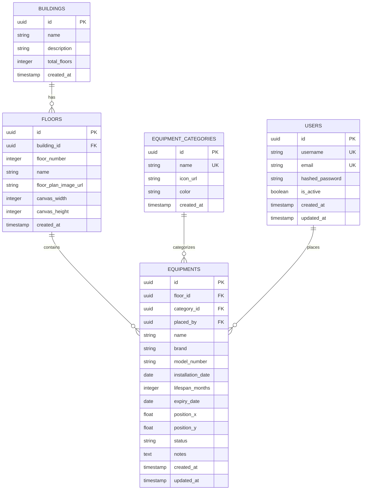
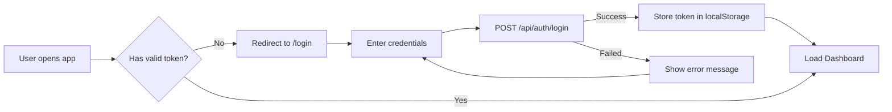
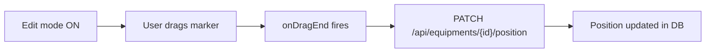
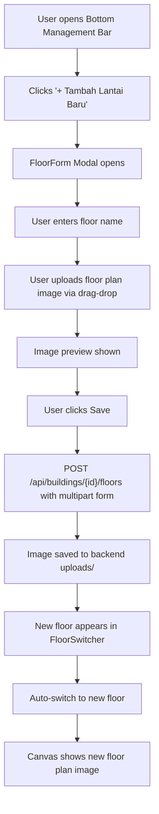
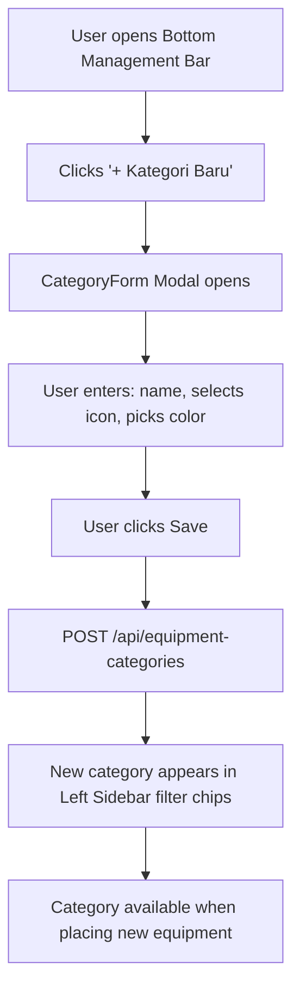
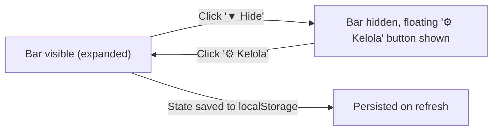
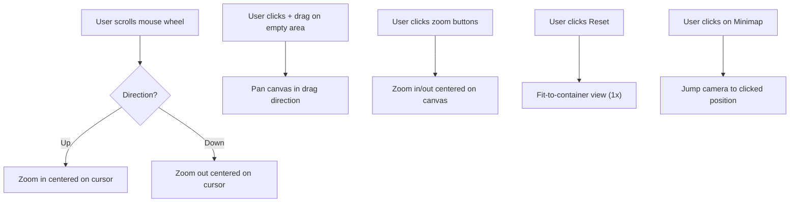
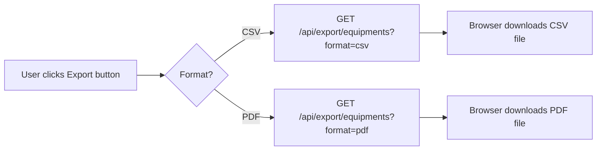
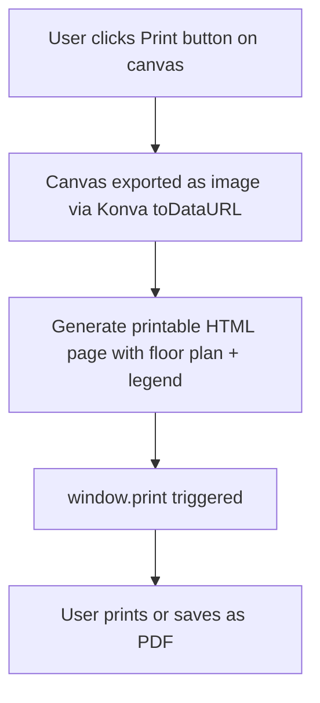
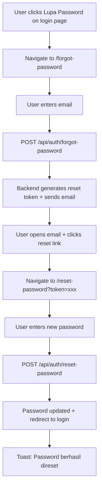

# Spil Denah — Interactive Building Floor Plan Monitoring System

Website interaktif untuk pemantauan barang elektronik (lampu, AC, dll) pada denah gedung berlantai, terinspirasi oleh UI Genshin Impact Interactive Map. Pengguna dapat melihat, menempatkan, dan mengelola barang elektronik pada denah lantai yang bersifat **dinamis** (bisa tambah/hapus lantai dengan upload gambar denah baru), dengan notifikasi visual untuk barang yang mendekati batas usia pakai. Canvas denah bersifat **fully interactive** — mendukung zoom in/out, drag/pan ke segala arah, dan navigasi yang mulus.

## User Review Required

> [!IMPORTANT]
> **Gambar Denah Lantai**: Apakah Anda sudah memiliki gambar denah untuk setiap lantai gedung (PNG/SVG), atau perlu kami buatkan placeholder denah sederhana terlebih dahulu? Gambar ini akan ditampilkan sebagai background pada canvas interaktif.

> [!IMPORTANT]  
> **Kategori Barang Elektronik**: Selain lampu dan AC, apakah ada kategori lain yang ingin ditambahkan? (misalnya: kipas angin, proyektor, CCTV, UPS, server, printer, dll.)

> [!IMPORTANT]
> **Multi-User / Role**: Apakah perlu ada role berbeda (misalnya Admin yang bisa edit, dan Viewer yang hanya bisa melihat)? Atau cukup satu role saja (semua user bisa edit setelah login)?

> [!WARNING]
> **Port Default**: Backend akan berjalan di port `8000`, Frontend di port `3000`, dan PostgreSQL di port `5432`. Pastikan port ini tidak bentrok dengan service lain di mesin Anda.

## Open Questions

1. **Notifikasi**: Selain tampilan visual di sidebar kanan (barang mendekati expired), apakah perlu fitur notifikasi email/push notification?
2. **SMTP Config untuk Forgot Password**: Fitur forgot password memerlukan SMTP server untuk mengirim email reset link. Apakah sudah ada SMTP server (Gmail, SendGrid, Mailgun) yang bisa dipakai? Atau cukup konfigurasi placeholder terlebih dahulu?

---

## Tech Stack

| Layer | Technology | Version |
|-------|-----------|---------|
| Frontend | React + Vite | React 18+, Vite 5+ |
| Interactive Canvas | Konva.js + react-konva | 8.x / 2.x |
| Routing | React Router DOM | v6 |
| HTTP Client | Axios | Latest |
| State Management | React Context + useReducer | Built-in |
| UI Icons | React Icons (lucide-react) | Latest |
| Backend | FastAPI | 0.110+ |
| ORM | SQLAlchemy 2.0 (Async) | 2.0+ |
| Migrations | Alembic | 1.13+ |
| Auth | JWT (python-jose + passlib[bcrypt]) | Latest |
| Database | PostgreSQL | 16 |
| Async DB Driver | asyncpg | Latest |
| Container | Docker + Docker Compose | Latest |

---

## Project Structure

```
Spil Denah/
├── docker-compose.yml
├── .env
├── .env.example
├── README.md
│
├── backend/
│   ├── Dockerfile
│   ├── requirements.txt
│   ├── alembic.ini
│   ├── alembic/
│   │   ├── env.py
│   │   ├── script.py.mako
│   │   └── versions/
│   │       └── 001_initial_migration.py
│   └── app/
│       ├── __init__.py
│       ├── main.py                    # FastAPI app entry + CORS
│       ├── config.py                  # Pydantic Settings
│       ├── database.py                # Async engine + session
│       ├── models/
│       │   ├── __init__.py
│       │   ├── user.py                # User model
│       │   ├── building.py            # Building model
│       │   ├── floor.py               # Floor model
│       │   ├── equipment_category.py  # Equipment category model
│       │   └── equipment.py           # Equipment placement model
│       ├── schemas/
│       │   ├── __init__.py
│       │   ├── user.py
│       │   ├── building.py
│       │   ├── floor.py
│       │   ├── equipment_category.py
│       │   └── equipment.py
│       ├── api/
│       │   ├── __init__.py
│       │   ├── deps.py                # Dependencies (get_db, get_current_user)
│       │   ├── auth.py                # Login, register, forgot password endpoints
│       │   ├── health.py              # Health check endpoint
│       │   ├── buildings.py           # Building CRUD
│       │   ├── floors.py              # Floor CRUD
│       │   ├── equipment_categories.py
│       │   ├── equipments.py          # Equipment CRUD + placement
│       │   └── export.py              # Data export (CSV/PDF) endpoints
│       ├── services/
│       │   ├── __init__.py
│       │   ├── auth_service.py        # Password hashing, JWT creation
│       │   ├── email_service.py       # Send password reset emails
│       │   ├── export_service.py      # Generate CSV/PDF exports
│       │   ├── image_service.py       # Image optimization/compression
│       │   └── equipment_service.py   # Business logic for equipment
│       ├── middleware/
│       │   ├── __init__.py
│       │   └── error_handler.py       # Global error handling middleware
│       └── utils/
│           ├── __init__.py
│           ├── security.py            # JWT encode/decode, password utils
│           └── sanitizer.py           # Input sanitization utilities
│
├── frontend/
│   ├── Dockerfile
│   ├── nginx.conf
│   ├── package.json
│   ├── vite.config.js
│   ├── index.html
│   ├── public/
│   │   └── (static assets only, floor plans stored on backend)
│   └── src/
│       ├── main.jsx
│       ├── App.jsx
│       ├── App.css
│       ├── index.css                  # Global styles + design tokens
│       │
│       ├── api/
│       │   ├── axios.js               # Axios instance with interceptors
│       │   ├── auth.js                # Auth API calls
│       │   ├── floors.js              # Floor CRUD + image upload API calls
│       │   ├── categories.js          # Equipment category CRUD API calls
│       │   └── equipment.js           # Equipment API calls
│       │
│       ├── contexts/
│       │   ├── AuthContext.jsx         # Auth state + protected route logic
│       │   └── ToastContext.jsx        # Toast notification state + provider
│       │
│       ├── components/
│       │   ├── ProtectedRoute.jsx      # Route guard component
│       │   ├── Layout/
│       │   │   ├── MainLayout.jsx      # Main app layout (sidebar left + canvas + sidebar right)
│       │   │   ├── LeftSidebar.jsx     # Equipment list + floor switcher
│       │   │   ├── RightSidebar.jsx    # Expiring equipment alerts
│       │   │   └── Header.jsx          # Top bar with logo + user info + logout
│       │   ├── Canvas/
│       │   │   ├── FloorCanvas.jsx     # Konva Stage with floor plan image + zoom/pan
│       │   │   ├── CanvasControls.jsx  # Zoom buttons, reset view, minimap toggle
│       │   │   ├── Minimap.jsx         # Small overview map in corner
│       │   │   ├── EquipmentMarker.jsx # Individual draggable equipment icon
│       │   │   └── MarkerPopup.jsx     # Popup showing equipment details
│       │   ├── Equipment/
│       │   │   ├── EquipmentList.jsx   # Scrollable list of all equipment
│       │   │   ├── EquipmentCard.jsx   # Individual equipment info card
│       │   │   ├── EquipmentForm.jsx   # Add/Edit equipment modal form
│       │   │   └── ExpiringList.jsx    # Right sidebar expiring items list
│       │   ├── Floor/
│       │   │   ├── FloorSwitcher.jsx   # Floor layer tabs (dynamic, add/remove)
│       │   │   └── FloorForm.jsx       # Modal form to add new floor + upload image
│       │   ├── Category/
│       │   │   └── CategoryForm.jsx    # Modal form to add/edit equipment category
│       │   ├── Management/
│       │   │   └── BottomManagementBar.jsx  # Hideable bottom bar for all management actions
│       │   └── UI/
│       │       ├── Modal.jsx           # Reusable modal component
│       │       ├── Button.jsx          # Styled button component
│       │       ├── Input.jsx           # Styled input component
│       │       ├── Badge.jsx           # Status badge component
│       │       ├── FileUpload.jsx      # Drag & drop file upload component
│       │       ├── Toast.jsx           # Toast notification component
│       │       ├── ConfirmDialog.jsx   # Confirmation dialog component
│       │       ├── Skeleton.jsx        # Neumorphic loading skeleton
│       │       └── ErrorBoundary.jsx   # React Error Boundary wrapper
│       │
│       └── pages/
│           ├── LoginPage.jsx           # Login form page
│           ├── ForgotPasswordPage.jsx  # Forgot password + reset form
│           └── DashboardPage.jsx       # Main floor plan dashboard
│
└── assets/
    └── icons/
        ├── lamp.svg
        ├── ac.svg
        ├── fan.svg
        └── projector.svg
```

---

## Database Schema

### ERD Diagram



### Table Details

#### `users`
| Column | Type | Constraint | Description |
|--------|------|-----------|-------------|
| id | UUID | PK, default uuid4 | Primary key |
| username | VARCHAR(50) | UNIQUE, NOT NULL | Login username |
| email | VARCHAR(100) | UNIQUE, NOT NULL | User email |
| hashed_password | VARCHAR(255) | NOT NULL | Bcrypt hashed password |
| is_active | BOOLEAN | DEFAULT true | Account status |
| reset_token | VARCHAR(255) | NULLABLE | Password reset token (hashed) |
| reset_token_expires | TIMESTAMP | NULLABLE | Reset token expiry time |
| created_at | TIMESTAMP | DEFAULT now() | Created timestamp |
| updated_at | TIMESTAMP | DEFAULT now() | Last update timestamp |

#### `buildings`
| Column | Type | Constraint | Description |
|--------|------|-----------|-------------|
| id | UUID | PK | Primary key |
| name | VARCHAR(100) | NOT NULL | Building name |
| description | TEXT | NULLABLE | Building description |
| total_floors | INTEGER | NOT NULL | Number of floors |
| created_at | TIMESTAMP | DEFAULT now() | Created timestamp |

#### `floors`
| Column | Type | Constraint | Description |
|--------|------|-----------|-------------|
| id | UUID | PK | Primary key |
| building_id | UUID | FK → buildings.id | Parent building |
| floor_number | INTEGER | NOT NULL | Floor number (dinamis, auto-increment per building) |
| name | VARCHAR(50) | NOT NULL | Display name ("Lantai 1", custom) |
| floor_plan_image_url | VARCHAR(500) | NULLABLE | Path to uploaded floor plan image |
| canvas_width | INTEGER | DEFAULT 1200 | Canvas width (auto-detected from image) |
| canvas_height | INTEGER | DEFAULT 800 | Canvas height (auto-detected from image) |
| sort_order | INTEGER | DEFAULT 0 | Display order in floor switcher |
| created_at | TIMESTAMP | DEFAULT now() | Created timestamp |
| updated_at | TIMESTAMP | DEFAULT now() | Last update timestamp |

#### `equipment_categories`
| Column | Type | Constraint | Description |
|--------|------|-----------|-------------|
| id | UUID | PK | Primary key |
| name | VARCHAR(50) | UNIQUE, NOT NULL | Category name (Lampu, AC, etc.) |
| icon_url | VARCHAR(500) | NULLABLE | SVG icon path |
| color | VARCHAR(7) | DEFAULT '#6366f1' | Category hex color |
| created_at | TIMESTAMP | DEFAULT now() | Created timestamp |

#### `equipments`
| Column | Type | Constraint | Description |
|--------|------|-----------|-------------|
| id | UUID | PK | Primary key |
| floor_id | UUID | FK → floors.id | Which floor |
| category_id | UUID | FK → equipment_categories.id | Equipment type |
| placed_by | UUID | FK → users.id | Who placed it |
| name | VARCHAR(100) | NOT NULL | Equipment name ("AC Ruang Meeting Lt.2") |
| brand | VARCHAR(100) | NULLABLE | Brand name |
| model_number | VARCHAR(100) | NULLABLE | Model/serial number |
| installation_date | DATE | NOT NULL | When installed |
| lifespan_months | INTEGER | NOT NULL | Expected lifespan in months |
| expiry_date | DATE | NOT NULL | Computed: installation_date + lifespan_months |
| position_x | FLOAT | NOT NULL | X position on canvas |
| position_y | FLOAT | NOT NULL | Y position on canvas |
| status | VARCHAR(20) | DEFAULT 'active' | 'active', 'warning', 'expired', 'replaced' |
| notes | TEXT | NULLABLE | Additional notes |
| created_at | TIMESTAMP | DEFAULT now() | Created timestamp |
| updated_at | TIMESTAMP | DEFAULT now() | Last update |

### Database Indexes

| Table | Column(s) | Index Type | Reason |
|-------|-----------|-----------|--------|
| `equipments` | `floor_id` | B-tree | Query equipment per floor |
| `equipments` | `category_id` | B-tree | Filter by category |
| `equipments` | `expiry_date` | B-tree | Query expiring equipment, sort by expiry |
| `equipments` | `status` | B-tree | Filter by status (active/warning/expired) |
| `equipments` | `placed_by` | B-tree | Query equipment by user |
| `floors` | `building_id` | B-tree | Query floors per building |
| `floors` | `sort_order` | B-tree | Sort floor display order |
| `users` | `reset_token` | B-tree | Lookup user by reset token |

> [!NOTE]
> Indexes dibuat di Alembic migration. Mempercepat query pada tabel yang sering diakses terutama saat jumlah equipment sudah banyak.

---

## API Endpoints

### Health Check

| Method | Endpoint | Description | Auth |
|--------|---------|-------------|------|
| GET | `/api/health` | Health check — returns app status, DB connection, version | No |

### Authentication

| Method | Endpoint | Description | Auth |
|--------|---------|-------------|------|
| POST | `/api/auth/register` | Register new user | No |
| POST | `/api/auth/login` | Login, returns JWT access + refresh tokens | No |
| POST | `/api/auth/refresh` | Refresh access token | Refresh Token |
| GET | `/api/auth/me` | Get current user profile | Bearer Token |
| POST | `/api/auth/forgot-password` | Send password reset email (accepts email) | No |
| POST | `/api/auth/reset-password` | Reset password with token | No |

### Buildings

| Method | Endpoint | Description | Auth |
|--------|---------|-------------|------|
| GET | `/api/buildings` | List all buildings | Bearer |
| GET | `/api/buildings/{id}` | Get building detail with floors | Bearer |
| POST | `/api/buildings` | Create building | Bearer |
| PUT | `/api/buildings/{id}` | Update building | Bearer |

### Floors (Dynamic — Add/Delete/Reorder)

| Method | Endpoint | Description | Auth |
|--------|---------|-------------|------|
| GET | `/api/buildings/{building_id}/floors` | List floors for a building (sorted) | Bearer |
| GET | `/api/floors/{id}` | Get floor detail with equipment count | Bearer |
| POST | `/api/buildings/{building_id}/floors` | **Create new floor** with name + floor plan image upload | Bearer |
| PUT | `/api/floors/{id}` | Update floor name / replace floor plan image | Bearer |
| DELETE | `/api/floors/{id}` | **Delete floor** (cascade deletes equipment on that floor) | Bearer |
| PATCH | `/api/floors/{id}/reorder` | Change floor sort order | Bearer |
| POST | `/api/floors/{id}/upload-image` | **Upload/replace floor plan image** (PNG/JPG/SVG, max 10MB) | Bearer |

### Equipment Categories

| Method | Endpoint | Description | Auth |
|--------|---------|-------------|------|
| GET | `/api/equipment-categories` | List all categories | Bearer |
| POST | `/api/equipment-categories` | Create category | Bearer |
| PUT | `/api/equipment-categories/{id}` | Update category | Bearer |
| DELETE | `/api/equipment-categories/{id}` | Delete category | Bearer |

### Equipments

| Method | Endpoint | Description | Auth |
|--------|---------|-------------|------|
| GET | `/api/floors/{floor_id}/equipments` | List equipment on a floor | Bearer |
| GET | `/api/equipments/{id}` | Get equipment detail | Bearer |
| POST | `/api/floors/{floor_id}/equipments` | Place new equipment on floor | Bearer |
| PUT | `/api/equipments/{id}` | Update equipment (data + position) | Bearer |
| PATCH | `/api/equipments/{id}/position` | Update position only (drag & drop) | Bearer |
| DELETE | `/api/equipments/{id}` | Remove equipment | Bearer |
| GET | `/api/equipments/expiring?days=30` | Get equipment expiring within N days | Bearer |
| GET | `/api/equipments/stats` | Dashboard stats (total, expiring, expired) | Bearer |

### Data Export

| Method | Endpoint | Description | Auth |
|--------|---------|-------------|------|
| GET | `/api/export/equipments?format=csv` | Export equipment list as CSV | Bearer |
| GET | `/api/export/equipments?format=pdf` | Export equipment list as PDF | Bearer |
| GET | `/api/export/floor/{floor_id}?format=csv` | Export equipment per floor as CSV | Bearer |
| GET | `/api/export/floor/{floor_id}?format=pdf` | Export equipment per floor as PDF | Bearer |

### File Upload / Static Files

| Method | Endpoint | Description | Auth |
|--------|---------|-------------|------|
| POST | `/api/upload/floor-plan` | Upload floor plan image (auto-optimized, returns URL) | Bearer |
| GET | `/api/uploads/{filename}` | Serve uploaded floor plan image | No (public static) |

---

## Proposed Changes

### 1. Docker & Infrastructure

#### [NEW] [docker-compose.yml](file:///Users/macbook-samuel/Documents/coding/Spil%20Denah/docker-compose.yml)
- 3 services: `backend` (FastAPI), `frontend` (React/Nginx), `db` (PostgreSQL 16)
- Shared network `spildenah-net`
- Volume `postgres_data` for persistence
- Environment variables from `.env`
- Backend depends on db with health check
- Frontend depends on backend

#### [NEW] [.env.example](file:///Users/macbook-samuel/Documents/coding/Spil%20Denah/.env.example)
```env
# Database
POSTGRES_USER=spildenah
POSTGRES_PASSWORD=spildenah_secret_2024
POSTGRES_DB=spildenah_db
DATABASE_URL=postgresql+asyncpg://spildenah:spildenah_secret_2024@db:5432/spildenah_db

# JWT
SECRET_KEY=your-super-secret-key-change-this-in-production
ALGORITHM=HS256
ACCESS_TOKEN_EXPIRE_MINUTES=30
REFRESH_TOKEN_EXPIRE_DAYS=7

# CORS
FRONTEND_URL=http://localhost:3000

# Backend
BACKEND_HOST=0.0.0.0
BACKEND_PORT=8000
```

---

### 2. Backend (FastAPI)

#### [NEW] [backend/Dockerfile](file:///Users/macbook-samuel/Documents/coding/Spil%20Denah/backend/Dockerfile)
- Python 3.11-slim base image
- Install dependencies from requirements.txt
- Run alembic migrations on startup, then launch uvicorn

#### [NEW] [backend/requirements.txt](file:///Users/macbook-samuel/Documents/coding/Spil%20Denah/backend/requirements.txt)
```text
fastapi==0.115.6
uvicorn[standard]==0.34.0
sqlalchemy[asyncio]==2.0.36
asyncpg==0.30.0
alembic==1.14.1
pydantic==2.10.4
pydantic-settings==2.7.1
python-jose[cryptography]==3.3.0
passlib[bcrypt]==1.7.4
python-multipart==0.0.20
aiofiles==24.1.0
Pillow==11.1.0               # Image optimization (resize, compress, format conversion)
bleach==6.2.0                # Input sanitization (strip dangerous HTML/JS)
reportlab==4.2.5             # PDF generation for data export
aiosmtplib==3.0.2            # Async SMTP for password reset emails
jinja2==3.1.5                # Email template rendering
itsdangerous==2.2.0          # Secure token generation for password reset
```

#### [NEW] [backend/app/config.py](file:///Users/macbook-samuel/Documents/coding/Spil%20Denah/backend/app/config.py)
- `Settings` class using pydantic-settings
- Load from environment variables: DATABASE_URL, SECRET_KEY, ALGORITHM, token expiry settings, CORS origins

#### [NEW] [backend/app/database.py](file:///Users/macbook-samuel/Documents/coding/Spil%20Denah/backend/app/database.py)
- Async SQLAlchemy engine using `create_async_engine`
- `AsyncSessionLocal` session factory
- `get_db()` async generator dependency
- `Base` declarative base for models

#### [NEW] [backend/app/models/](file:///Users/macbook-samuel/Documents/coding/Spil%20Denah/backend/app/models/)
- **user.py**: `User` model with UUID PK, username, email, hashed_password, is_active, timestamps
- **building.py**: `Building` model with name, description, total_floors. Has relationship to `floors`
- **floor.py**: `Floor` model with building_id FK, floor_number, name, floor_plan_image_url, canvas dimensions. Has relationship to `equipments`
- **equipment_category.py**: `EquipmentCategory` model with name (unique), icon_url, color
- **equipment.py**: `Equipment` model with floor_id FK, category_id FK, placed_by FK, name, brand, model_number, installation_date, lifespan_months, expiry_date (computed), position_x, position_y, status (enum: active/warning/expired/replaced), notes, timestamps

#### [NEW] [backend/app/schemas/](file:///Users/macbook-samuel/Documents/coding/Spil%20Denah/backend/app/schemas/)
- Pydantic v2 schemas for request/response validation
- **user.py**: `UserCreate`, `UserLogin`, `UserResponse`, `TokenResponse`
- **building.py**: `BuildingCreate`, `BuildingUpdate`, `BuildingResponse`
- **floor.py**: `FloorCreate`, `FloorUpdate`, `FloorResponse`
- **equipment_category.py**: `CategoryCreate`, `CategoryUpdate`, `CategoryResponse`
- **equipment.py**: `EquipmentCreate`, `EquipmentUpdate`, `EquipmentPositionUpdate`, `EquipmentResponse`, `EquipmentWithCategory`

#### [NEW] [backend/app/utils/security.py](file:///Users/macbook-samuel/Documents/coding/Spil%20Denah/backend/app/utils/security.py)
- `hash_password(password)` → bcrypt hash
- `verify_password(plain, hashed)` → boolean
- `create_access_token(data, expires_delta)` → JWT string
- `create_refresh_token(data)` → JWT string
- `decode_token(token)` → payload dict

#### [NEW] [backend/app/api/deps.py](file:///Users/macbook-samuel/Documents/coding/Spil%20Denah/backend/app/api/deps.py)
- `get_db()` → AsyncSession dependency
- `get_current_user(token)` → User dependency. Decodes JWT from `Authorization: Bearer <token>`, raises 401 if invalid

#### [NEW] [backend/app/api/auth.py](file:///Users/macbook-samuel/Documents/coding/Spil%20Denah/backend/app/api/auth.py)
- `POST /register`: Create user, hash password, return user data
- `POST /login`: Verify credentials, return access_token + refresh_token
- `POST /refresh`: Validate refresh token, issue new access token
- `GET /me`: Return current user info (protected)
- `POST /forgot-password`: Accept email → generate reset token (hashed, 1h expiry) → send email with reset link
- `POST /reset-password`: Accept token + new password → validate token → update password → invalidate token

#### [NEW] [backend/app/api/health.py](file:///Users/macbook-samuel/Documents/coding/Spil%20Denah/backend/app/api/health.py)
- `GET /health`: Returns JSON `{ status: "ok", database: "connected", version: "1.0.0", timestamp: "..." }`
- Checks database connectivity with a simple query
- Returns 503 if database is unreachable
- No authentication required (for monitoring tools)

#### [NEW] [backend/app/api/export.py](file:///Users/macbook-samuel/Documents/coding/Spil%20Denah/backend/app/api/export.py)
- `GET /export/equipments?format=csv`: Generate CSV with all equipment data (name, category, floor, dates, status)
- `GET /export/equipments?format=pdf`: Generate PDF report with table + summary stats
- `GET /export/floor/{floor_id}?format=csv|pdf`: Export per floor
- CSV: Return as `StreamingResponse` with `Content-Disposition: attachment`
- PDF: Generate via ReportLab with header, table, footer, timestamps

#### [NEW] [backend/app/api/buildings.py](file:///Users/macbook-samuel/Documents/coding/Spil%20Denah/backend/app/api/buildings.py)
- Full CRUD for buildings
- All endpoints require authentication

#### [NEW] [backend/app/api/floors.py](file:///Users/macbook-samuel/Documents/coding/Spil%20Denah/backend/app/api/floors.py)
- **Full CRUD** for floors under a building (including **DELETE** with cascade)
- **POST create floor**: Accepts `multipart/form-data` with floor name + floor plan image file
- **POST upload-image**: Upload/replace floor plan image for an existing floor
- Auto-detect image dimensions → set `canvas_width` and `canvas_height`
- Auto-assign `floor_number` (next available) and `sort_order`
- **DELETE floor**: Cascade deletes all equipment on that floor, with confirmation prompt on frontend
- **PATCH reorder**: Update `sort_order` for floor display ordering
- Uploaded images saved to `backend/uploads/floor-plans/` directory (Docker volume mounted)
- Validate file type (PNG/JPG/SVG only) and size (max 10MB)

#### [NEW] [backend/app/api/equipment_categories.py](file:///Users/macbook-samuel/Documents/coding/Spil%20Denah/backend/app/api/equipment_categories.py)
- CRUD for equipment categories (Lampu, AC, etc.)

#### [NEW] [backend/app/api/equipments.py](file:///Users/macbook-samuel/Documents/coding/Spil%20Denah/backend/app/api/equipments.py)
- CRUD for equipment placement on floors
- `PATCH /position` for drag-and-drop position updates
- `GET /expiring?days=30` for querying equipment near expiry
- `GET /stats` for dashboard statistics
- Automatic status computation based on `expiry_date` vs current date

#### [NEW] [backend/app/services/equipment_service.py](file:///Users/macbook-samuel/Documents/coding/Spil%20Denah/backend/app/services/equipment_service.py)
- `compute_expiry_date(installation_date, lifespan_months)` → date
- `compute_status(expiry_date)` → 'active' | 'warning' (≤30 days) | 'expired'
- `get_expiring_equipments(db, days)` → list of equipment expiring within N days
- `get_equipment_stats(db)` → dict with counts

#### [NEW] [backend/app/services/image_service.py](file:///Users/macbook-samuel/Documents/coding/Spil%20Denah/backend/app/services/image_service.py)
- `optimize_image(file_bytes, max_width=4096)` → optimized bytes
- Resize image if larger than max_width (maintain aspect ratio)
- Compress to WebP format (80% quality) for smaller file size
- Fallback to JPEG if WebP not supported
- Auto-detect dimensions → return `(width, height)` for canvas sizing
- Strip EXIF metadata for privacy

#### [NEW] [backend/app/services/export_service.py](file:///Users/macbook-samuel/Documents/coding/Spil%20Denah/backend/app/services/export_service.py)
- `generate_csv(equipments)` → CSV string/bytes with columns: Name, Category, Floor, Brand, Model, Installation Date, Expiry Date, Status, Days Remaining
- `generate_pdf(equipments, title)` → PDF bytes via ReportLab
  - Header: "Laporan Inventaris Barang Elektronik" + tanggal export
  - Table: Semua data equipment
  - Summary: Total per status (active/warning/expired)
  - Footer: "Generated by Spil Denah"

#### [NEW] [backend/app/services/email_service.py](file:///Users/macbook-samuel/Documents/coding/Spil%20Denah/backend/app/services/email_service.py)
- `send_reset_email(to_email, reset_link)` → send email via SMTP (async)
- HTML email template with Jinja2: app logo, greeting, reset button, expiry info
- Config: SMTP host/port/user/password from environment variables
- Graceful fallback: if SMTP not configured, log reset link to console (for development)

#### [NEW] [backend/app/middleware/error_handler.py](file:///Users/macbook-samuel/Documents/coding/Spil%20Denah/backend/app/middleware/error_handler.py)
- Global exception handler middleware for FastAPI
- Catches all unhandled exceptions → returns JSON `{ error: "...", detail: "...", status_code: 500 }`
- In production: hides stack trace, returns generic message
- In development: includes full traceback in response
- Logs every error with `logger.exception()`
- Handles specific exceptions: `HTTPException`, `ValidationError`, `SQLAlchemyError`, `IntegrityError`

#### [NEW] [backend/app/utils/sanitizer.py](file:///Users/macbook-samuel/Documents/coding/Spil%20Denah/backend/app/utils/sanitizer.py)
- `sanitize_text(input_string)` → cleaned string (strips HTML tags, JS, dangerous content)
- Uses `bleach.clean()` with whitelist of allowed tags (none by default)
- Applied to all user text inputs: equipment name, notes, floor name, category name
- Integrated as Pydantic validator or dependency

#### [NEW] [backend/app/main.py](file:///Users/macbook-samuel/Documents/coding/Spil%20Denah/backend/app/main.py)
- FastAPI app initialization
- **Global error handler middleware** registered (catches all unhandled exceptions)
- CORS middleware with frontend origin
- Include all API routers with `/api` prefix (including `/api/health` and `/api/export`)
- Mount `/api/uploads` as static file serving for uploaded floor plan images
- Startup event for seeding initial data (default building, default categories, default admin user)
- Create `uploads/floor-plans/` directory on startup if not exists

#### [NEW] Alembic Configuration
- `alembic.ini` with async PostgreSQL URL
- `alembic/env.py` configured for async migrations
- Initial migration creating all tables

---

### 3. Frontend (React + Vite)

#### [NEW] [frontend/Dockerfile](file:///Users/macbook-samuel/Documents/coding/Spil%20Denah/frontend/Dockerfile)
- Multi-stage build:
  - Stage 1: Node 20-alpine, `npm install` + `npm run build`
  - Stage 2: Nginx-alpine, copy build output + nginx.conf

#### [NEW] [frontend/nginx.conf](file:///Users/macbook-samuel/Documents/coding/Spil%20Denah/frontend/nginx.conf)
- Serve static files from `/usr/share/nginx/html`
- Proxy `/api` requests to backend service
- SPA fallback: all routes → `index.html`
- **Gzip compression** enabled for text/html, text/css, application/javascript, application/json
- Security headers: `X-Frame-Options: DENY`, `X-Content-Type-Options: nosniff`, `X-XSS-Protection: 1; mode=block`

#### [NEW] [frontend/src/index.css](file:///Users/macbook-samuel/Documents/coding/Spil%20Denah/frontend/src/index.css)
Design system global styles — **Neumorphism (Soft UI) Design Concept**:

**Neumorphism Core Principle**: UI elements appear extruded from or pressed into the background surface using dual soft shadows (one light, one dark) — creating a tactile, 3D-like appearance without hard edges or borders.

- **Color palette (Light Neumorphism)**:
  - Base surface: `#e0e5ec` (soft gray — the "canvas" color everything sits on)
  - Card/raised surface: `#e0e5ec` (same as background — depth via shadows only)
  - Primary accent: `#6366f1` (indigo) for active states, toggles, selected items
  - Secondary accent: `#818cf8` (light indigo) for hover states
  - Success/Active: `#22c55e` (green)
  - Warning: `#f59e0b` (amber)
  - Danger/Expired: `#ef4444` (red)
  - Text primary: `#2d3436` (dark charcoal)
  - Text secondary: `#636e72` (medium gray)
  - Text muted: `#a0aab0` (light gray)

- **Neumorphism Shadow System** (CSS custom properties):
  ```css
  /* Raised element (default state) */
  --neu-shadow-raised: 6px 6px 12px #b8bec7, -6px -6px 12px #ffffff;
  /* Pressed/inset element (active/clicked state) */
  --neu-shadow-inset: inset 4px 4px 8px #b8bec7, inset -4px -4px 8px #ffffff;
  /* Subtle raised (for small elements like badges) */
  --neu-shadow-sm: 3px 3px 6px #b8bec7, -3px -3px 6px #ffffff;
  /* Large raised (for modals, popups) */
  --neu-shadow-lg: 10px 10px 20px #b8bec7, -10px -10px 20px #ffffff;
  /* Flat (no shadow — used during transitions) */
  --neu-shadow-flat: 0px 0px 0px #b8bec7, 0px 0px 0px #ffffff;
  ```

- **Dark Mode Neumorphism** (toggle-able):
  - Base surface: `#2d3436`
  - Light shadow: `#3d4447`
  - Dark shadow: `#1d2425`
  - Text: `#e2e8f0`

- **Typography**: Google Font "Inter" for body, "Outfit" for headings
- **Border radius**: Generous rounded corners (12px cards, 16px modals, 50px buttons/pills)
- **No hard borders**: Elements are defined purely by shadow depth
- **Input fields**: Inset neumorphic shadow (appear "pressed into" surface)
- **Buttons**: Raised neumorphic by default, inset on `:active` press
- **Scrollbar**: Custom styled to match neumorphic theme (rounded, subtle)
- **Transitions**: 200ms ease-in-out on shadows, transforms, and colors
- **Micro-animations**: Subtle scale (0.98) on button press, smooth shadow transitions

- **Responsive Breakpoints** (Mobile-first):
  ```css
  /* Mobile (default) */
  /* Small tablet: min-width 640px */
  /* Tablet: min-width 768px */
  /* Desktop: min-width 1024px */
  /* Large desktop: min-width 1280px */
  ```

#### [NEW] [frontend/src/api/axios.js](file:///Users/macbook-samuel/Documents/coding/Spil%20Denah/frontend/src/api/axios.js)
- Axios instance with `baseURL: '/api'`
- Request interceptor: attach `Authorization: Bearer <token>` from localStorage
- Response interceptor: on 401, attempt token refresh or redirect to login

#### [NEW] [frontend/src/api/auth.js](file:///Users/macbook-samuel/Documents/coding/Spil%20Denah/frontend/src/api/auth.js)
- `login(username, password)` → returns tokens
- `register(username, email, password)` → returns user
- `refreshToken()` → returns new access token
- `getMe()` → returns current user
- `forgotPassword(email)` → triggers reset email
- `resetPassword(token, newPassword)` → resets password

#### [NEW] [frontend/src/api/export.js](file:///Users/macbook-samuel/Documents/coding/Spil%20Denah/frontend/src/api/export.js)
- `exportEquipmentCSV(floorId?)` → download CSV file
- `exportEquipmentPDF(floorId?)` → download PDF file
- Handle file download via blob + `URL.createObjectURL`

#### [NEW] [frontend/src/api/equipment.js](file:///Users/macbook-samuel/Documents/coding/Spil%20Denah/frontend/src/api/equipment.js)
- All equipment API calls: CRUD, position update, expiring list, stats
- Building and floor API calls
- Category API calls

#### [NEW] [frontend/src/contexts/AuthContext.jsx](file:///Users/macbook-samuel/Documents/coding/Spil%20Denah/frontend/src/contexts/AuthContext.jsx)
- `AuthProvider` with state: `user`, `token`, `isAuthenticated`, `isLoading`
- On mount: check localStorage for token, call `/auth/me` to validate
- `login()`, `logout()`, `register()` functions
- Export `useAuth()` hook

#### [NEW] [frontend/src/components/ProtectedRoute.jsx](file:///Users/macbook-samuel/Documents/coding/Spil%20Denah/frontend/src/components/ProtectedRoute.jsx)
- Wraps `<Outlet />` from React Router
- If not authenticated → redirect to `/login`
- If loading → show **neumorphic loading skeleton** (not spinner)
- If authenticated → render children

#### [NEW] [frontend/src/App.jsx](file:///Users/macbook-samuel/Documents/coding/Spil%20Denah/frontend/src/App.jsx) — React Lazy Loading
- Uses `React.lazy()` + `Suspense` for code-splitting pages:
  ```jsx
  const LoginPage = React.lazy(() => import('./pages/LoginPage'));
  const ForgotPasswordPage = React.lazy(() => import('./pages/ForgotPasswordPage'));
  const DashboardPage = React.lazy(() => import('./pages/DashboardPage'));
  ```
- `<Suspense fallback={<LoadingSkeleton />}>` wraps lazy-loaded routes
- Reduces initial bundle size — login page doesn't load dashboard code and vice versa
- Wrapped in `<ErrorBoundary>` to catch render errors

#### [NEW] [frontend/src/pages/LoginPage.jsx](file:///Users/macbook-samuel/Documents/coding/Spil%20Denah/frontend/src/pages/LoginPage.jsx)
- Full-screen neumorphic login page with soft background (`#e0e5ec`)
- Centered neumorphic **raised card** containing the login form
- Logo/app name at top with subtle shadow text
- Username + password fields with **inset neumorphic styling** (pressed-in look)
- Login button with **raised neumorphic style** → **inset on press** (tactile feel)
- Link to register (toggle between login/register forms within same card)
- Subtle animated gradient or floating soft circles in background
- Error messages with smooth fade-in + soft red accent
- **Responsive**: Card takes full width on mobile (with padding), max-width 420px on desktop
- **"Lupa Password?" link** → navigates to `/forgot-password`

#### [NEW] [frontend/src/pages/ForgotPasswordPage.jsx](file:///Users/macbook-samuel/Documents/coding/Spil%20Denah/frontend/src/pages/ForgotPasswordPage.jsx)
Neumorphic page for password reset flow (2 states):
- **State 1: Request Reset** (route: `/forgot-password`)
  - Email input field (neumorphic inset)
  - "Kirim Link Reset" button
  - On submit → `POST /api/auth/forgot-password` → show success message "Cek email Anda"
  - Link back to login
- **State 2: Set New Password** (route: `/reset-password?token=xxx`)
  - New password input + confirm password input
  - Password strength indicator (visual bar: weak/medium/strong)
  - "Reset Password" button
  - On submit → `POST /api/auth/reset-password` → redirect to login with success toast
- **Responsive**: Same pattern as LoginPage (full-width on mobile)

#### [NEW] [frontend/src/pages/DashboardPage.jsx](file:///Users/macbook-samuel/Documents/coding/Spil%20Denah/frontend/src/pages/DashboardPage.jsx)
- Main layout orchestrator
- Fetches building, floors, equipment data
- Manages state: `selectedFloor`, `selectedEquipment`, `isEditMode`, `filterCategories`
- Passes data to child components
- **Export buttons** in header/toolbar: Export CSV, Export PDF, Print Floor Plan
- **All text inputs sanitized** before sending to API (strip HTML/JS)

---

### 4. Frontend Components (Detail)

#### Responsive Layout Strategy

```
📱 MOBILE (< 768px)                    💻 DESKTOP (≥ 1024px)
┌─────────────────────┐                ┌──────────────────────────────────────────────┐
│  Header (compact)   │                │  Header (logo, building name, user, logout)  │
│  ☰  Spil Denah  👤  │                ├─────────┬────────────────────────┬───────────┤
├─────────────────────┤                │         │                        │           │
│                     │                │  Left   │                        │  Right    │
│   Floor Canvas      │                │ Sidebar │    Floor Canvas        │  Sidebar  │
│   (full width)      │                │ (280px) │    (flexible)          │  (300px)  │
│                     │                │         │                        │           │
│   [zoom controls]   │                │ -Floor  │  - Konva Stage         │ -Expiring │
│                     │                │  Tabs   │  - Floor plan bg       │  Equip.   │
├─────────────────────┤                │ -Search │  - Equipment markers   │  List     │
│ ⚙ Management Bar  ▼│  ← hide/unhide│ -Filter │  - Zoom/Pan controls   │ -Stats    │
│ [+Floor][+Category] │                │ -Equip. │                        │           │
│ [✏Edit Mode][+Item] │                │  List   │                        │           │
├─────────────────────┤                ├─────────┴────────────────────────┴───────────┤
│ ◀ Floor ▶  Filter ▼ │                │ ⚙ Management Bar (hide/unhide toggle)  [▼]  │
│  Bottom toolbar     │                │ [+ Tambah Lantai] [+ Kategori Baru]          │
└─────────────────────┘                │ [✏ Edit Penempatan] [+ Tambah Barang]        │
                                       └──────────────────────────────────────────────┘
  ↕ Swipe up: Left sidebar                              
    as bottom sheet drawer                               
  ↕ Swipe right: Right sidebar                          
    as right drawer overlay                              
```

#### Layout Components

#### [NEW] [MainLayout.jsx](file:///Users/macbook-samuel/Documents/coding/Spil%20Denah/frontend/src/components/Layout/MainLayout.jsx)
Responsive neumorphic three-column layout:

**Desktop (≥ 1024px)**: Three columns side by side
- Left sidebar (280px, fixed) + Canvas (flexible) + Right sidebar (300px, fixed)
- All three visible simultaneously
- Sidebars have neumorphic raised panels

**Tablet (768px – 1023px)**: Two columns
- Left sidebar (260px) + Canvas (flexible)
- Right sidebar becomes a **slide-in drawer** from right (triggered by bell/alert icon in header)
- Overlay with backdrop when right drawer is open

**Mobile (< 768px)**: Single column, canvas-focused
- Canvas takes full viewport width and height (minus header + bottom bars)
- Left sidebar becomes a **bottom sheet drawer** (swipe up from bottom toolbar to expand)
  - Three states: collapsed (toolbar only), half-expanded, full-expanded
  - Touch gesture: drag handle at top of sheet
- Right sidebar becomes a **right edge drawer** (swipe left or tap alert icon)
- **Bottom Management Bar**: Fixed above bottom toolbar, contains all management actions
- **Bottom toolbar**: Fixed at bottom with floor switcher (horizontal scroll) + filter button

**CSS**: Use CSS Grid with `grid-template-columns` adapting via media queries. Neumorphic raised panel styling on sidebar containers.

#### [NEW] [LeftSidebar.jsx](file:///Users/macbook-samuel/Documents/coding/Spil%20Denah/frontend/src/components/Layout/LeftSidebar.jsx)
- **Floor Switcher** (dynamic):
  - Vertical list showing all floors with active state indicator
  - **"+ Tambah Lantai" button** at bottom → opens `FloorForm` modal
  - Each floor item shows: floor name, equipment count badge
  - Right-click / kebab menu on floor item → Edit name, Replace image, Delete floor
  - Smooth transition when switching floors (fade out old markers, fade in new ones)
- **Search Bar**: Filter equipment by name
- **Category Filter**: Toggleable category chips (Lampu, AC, etc.) with icons and counts — similar to Genshin map's "Select All / Clear" feature
- **Equipment List**: Scrollable list of all equipment on selected floor, each showing:
  - Category icon + color
  - Equipment name
  - Status badge (active/warning/expired)
  - Installation date
  - Click to highlight on canvas + auto-pan/zoom to marker position

#### [NEW] [RightSidebar.jsx](file:///Users/macbook-samuel/Documents/coding/Spil%20Denah/frontend/src/components/Layout/RightSidebar.jsx)
- **Stats Cards**: Total equipment, active, warning, expired counts with animated counters — neumorphic raised cards
- **Expiring Soon List**: Equipment sorted by closest expiry date
  - Shows remaining days with color coding
  - Red neumorphic inset for expired items
  - Orange accent for warning (≤30 days)
  - Click to navigate to that floor + highlight marker
- **Desktop**: Fixed right column (300px)
- **Tablet/Mobile**: Slide-in drawer from right edge, triggered by alert bell icon in header
  - Drawer has neumorphic raised panel with drag handle
  - Backdrop overlay when open
  - Swipe right to close

#### [NEW] [Header.jsx](file:///Users/macbook-samuel/Documents/coding/Spil%20Denah/frontend/src/components/Layout/Header.jsx)
Neumorphic raised header bar (**tanpa edit mode — dipindah ke Bottom Management Bar**):
- **Desktop**: Full width bar with logo + "Spil Denah" title + building name + user info + logout
- **Mobile**: Compact bar with hamburger menu (☰) + "Spil Denah" + alert bell icon (opens right drawer) + user avatar
  - Hamburger opens left sidebar as bottom sheet
  - Bell icon shows badge count of expiring items
- Logout button: neumorphic raised, danger variant on hover

#### Canvas Components

#### [NEW] [FloorCanvas.jsx](file:///Users/macbook-samuel/Documents/coding/Spil%20Denah/frontend/src/components/Canvas/FloorCanvas.jsx)
**This is the core interactive component** using `react-konva` — fully interactive canvas with zoom, pan, and drag:

- `<Stage>` fills the center column, responsive to container size
- `<Layer>` for floor plan background image (loaded via `use-image` hook from backend URL)
- `<Layer>` for equipment markers

**🔍 Zoom Controls (Detail)**:
- **Mouse wheel zoom**: Scroll up = zoom in, scroll down = zoom out
- **Zoom range**: 0.3x (fully zoomed out) to 5x (fully zoomed in)
- **Zoom to cursor**: Zooms centered on mouse pointer position (not center of canvas)
- **Pinch-to-zoom**: Two-finger pinch on touchpad/mobile
- **Zoom buttons**: `+` / `-` buttons in `CanvasControls` overlay (bottom-right corner)
- **Reset zoom**: Button to reset to fit-to-container view (1x)
- **Zoom level indicator**: Shows current zoom percentage (e.g., "150%")
- **Smooth zoom animation**: Uses `Konva.Tween` for animated zoom transitions

**🖱️ Pan / Drag Controls (Detail)**:
- **Click and drag**: Hold left mouse button on empty canvas area → drag to pan in any direction (up/down/left/right)
- **Canvas cursor**: Shows `grab` cursor by default, `grabbing` while dragging
- **Bounded panning**: Prevents panning beyond image edges (with small overflow margin)
- **Inertia scrolling**: Optional smooth deceleration after releasing drag
- **Touch drag**: Single-finger drag on mobile/touchpad
- **Middle mouse button**: Alternative pan with middle mouse button

**🗺️ Minimap** (bottom-left corner overlay):
- Small thumbnail of entire floor plan
- Viewport rectangle showing current visible area
- Click on minimap to jump to that position
- Toggleable visibility via `CanvasControls`

**View Mode** (default):
  - Click marker → show `MarkerPopup` with equipment details
  - Hover marker → show tooltip with name + status
  - Double-click on empty space → zoom in 2x at that position

**Edit Mode** (when edit toggle is ON **via Bottom Management Bar**):
  - Click on empty space → open `EquipmentForm` modal to add new equipment at that position (position converted from screen coords to canvas coords accounting for zoom/pan offset)
  - Drag existing markers → update position via `PATCH /position` API
  - Right-click marker → context menu (Edit, Delete)
  - Marker positions stored in **canvas-relative coordinates** (not screen coordinates), so they remain correct regardless of zoom/pan state
  - Canvas border glows with accent color to indicate edit mode is active

- **Responsive**: Canvas resizes with window (`ResizeObserver` on container)
- **Marker Filtering**: Show/hide markers based on sidebar category filters
- **Floor transition**: Smooth fade when switching floors (old image fades out, new image fades in)

#### [NEW] [CanvasControls.jsx](file:///Users/macbook-samuel/Documents/coding/Spil%20Denah/frontend/src/components/Canvas/CanvasControls.jsx)
Floating neumorphic control panel overlaid on bottom-right of canvas:
- **Zoom In** button (`+` icon) — neumorphic raised circle
- **Zoom Out** button (`-` icon) — neumorphic raised circle
- **Reset View** button (fit-to-screen icon) — resets zoom to 1x and centers canvas
- **Zoom percentage display** (e.g., "150%") — neumorphic inset pill
- **Minimap toggle** button (map icon)
- **Fullscreen toggle** button (expand icon) — canvas fills entire viewport
- All buttons have **raised → inset** press animation
- Keyboard shortcuts: `+`/`-` for zoom, `0` for reset, `F` for fullscreen
- **Mobile**: Buttons slightly larger (44px min touch target), positioned to avoid thumb overlap

#### [NEW] [Minimap.jsx](file:///Users/macbook-samuel/Documents/coding/Spil%20Denah/frontend/src/components/Canvas/Minimap.jsx)
- Small (200×140px) thumbnail canvas in bottom-left corner
- Shows scaled-down floor plan image
- Semi-transparent blue rectangle showing current viewport area
- Click to jump camera to clicked position
- Drag viewport rectangle to pan
- Auto-hides when zoom level is 1x (full view visible)
- Neumorphic raised container with subtle inner shadow border
- **Mobile**: Smaller (140×100px) or hidden by default (toggle via CanvasControls)

#### [NEW] [EquipmentMarker.jsx](file:///Users/macbook-samuel/Documents/coding/Spil%20Denah/frontend/src/components/Canvas/EquipmentMarker.jsx)
- Konva `<Group>` containing:
  - `<Circle>` background with category color
  - `<Image>` for category icon (SVG rendered to canvas)
  - `<Text>` label below marker
- **Status visual indicators**:
  - Active: solid color, normal
  - Warning: pulsing orange ring animation (Konva animation)
  - Expired: red ring + crosshatch overlay
- **Draggable** in edit mode (disabled in view mode)
- **Events**: onClick, onDragEnd, onMouseEnter, onMouseLeave

#### [NEW] [MarkerPopup.jsx](file:///Users/macbook-samuel/Documents/coding/Spil%20Denah/frontend/src/components/Canvas/MarkerPopup.jsx)
- HTML overlay (not Konva) positioned relative to marker
- **Neumorphic raised card** with soft shadow
- Shows: name, category, brand, model, installation date, expiry date, remaining days, status badge
- Buttons: Edit, Delete (visible in edit mode) — neumorphic small raised buttons
- Smooth scale + fade-in animation
- Auto-repositions to stay within viewport
- **Mobile**: Appears as a **bottom card** (fixed at bottom of screen) instead of floating near marker, with swipe-down to dismiss

#### Equipment Components

#### [NEW] [EquipmentForm.jsx](file:///Users/macbook-samuel/Documents/coding/Spil%20Denah/frontend/src/components/Equipment/EquipmentForm.jsx)
Neumorphic modal form for adding/editing equipment:
- **Fields**:
  - Name (text input — neumorphic inset)
  - Category (dropdown with icons — neumorphic inset select)
  - Brand (text input)
  - Model/Serial Number (text input)
  - Installation Date (date picker — neumorphic inset)
  - Lifespan in months (number input — neumorphic inset)
  - Computed expiry date (auto-calculated, read-only display in neumorphic flat pill)
  - Notes (textarea — neumorphic inset)
- **Validation**: Required fields highlighted with red accent shadow
- **Auto-compute**: When installation_date and lifespan_months change, show computed expiry_date
- **Save** (neumorphic raised primary) / **Cancel** (neumorphic raised ghost) buttons with loading state
- **Mobile**: Form renders as a **full-screen modal** (slides up from bottom) instead of centered popup. Inputs stack vertically with comfortable spacing for thumb use.

#### [NEW] [EquipmentCard.jsx](file:///Users/macbook-samuel/Documents/coding/Spil%20Denah/frontend/src/components/Equipment/EquipmentCard.jsx)
- Compact card in left sidebar list
- Category icon + color bar
- Equipment name (bold)
- Status badge (green/orange/red)
- Hover: subtle lift animation + highlight corresponding marker on canvas
- Click: center canvas on this equipment's position

#### [NEW] [ExpiringList.jsx](file:///Users/macbook-samuel/Documents/coding/Spil%20Denah/frontend/src/components/Equipment/ExpiringList.jsx)
- Right sidebar component
- Sorted by closest expiry
- Each item shows: icon, name, floor, "X days remaining" or "Expired X days ago"
- Color-coded progress bar showing remaining life percentage
- Animated countdown for critical items
- Click → auto-switches to that floor + pan/zoom to marker

#### Floor Components

#### [NEW] [FloorSwitcher.jsx](file:///Users/macbook-samuel/Documents/coding/Spil%20Denah/frontend/src/components/Floor/FloorSwitcher.jsx)
- Vertical list of floor buttons in left sidebar
- Each button shows: floor name + equipment count badge
- Active floor highlighted with accent color + left border indicator
- Kebab menu (⋮) on each floor for: Edit Name, Replace Image, Delete Floor
- Delete floor shows confirmation dialog warning about equipment loss
- Smooth reorder animation (future: drag to reorder floors)
- **Note**: "+ Tambah Lantai" action dipindah ke Bottom Management Bar

#### [NEW] [FloorForm.jsx](file:///Users/macbook-samuel/Documents/coding/Spil%20Denah/frontend/src/components/Floor/FloorForm.jsx)
Modal form for **adding a new floor** or **editing existing floor**:
- **Fields**:
  - Floor Name (text input, e.g., "Lantai 5", "Basement", "Rooftop")
  - Floor Plan Image (drag-and-drop file upload area using `FileUpload` component)
    - Accepts: PNG, JPG, JPEG, SVG
    - Max size: 10MB
    - Shows image preview after selection
    - Can drag file from desktop into the upload zone
  - Notes (optional textarea)
- On submit:
  - Uploads image via `POST /api/floors/{id}/upload-image`
  - Creates floor via `POST /api/buildings/{building_id}/floors`
  - New floor appears immediately in `FloorSwitcher`
  - Auto-switches to the newly created floor
- **Edit mode**: Pre-fills name, shows current floor plan image with "Replace" option

#### Category Components

#### [NEW] [CategoryForm.jsx](file:///Users/macbook-samuel/Documents/coding/Spil%20Denah/frontend/src/components/Category/CategoryForm.jsx)
Neumorphic modal form for **adding a new equipment category** or **editing existing category**:
- **Fields**:
  - Category Name (text input — e.g., "CCTV", "UPS", "Printer", "Server")
  - Icon selection (grid of icon options to choose from, or upload custom SVG icon)
  - Color (color picker — hex color for the category marker on canvas)
- **Validation**: Name must be unique, color must be valid hex
- On submit:
  - `POST /api/equipment-categories` to create
  - `PUT /api/equipment-categories/{id}` to edit
  - New category appears immediately in Left Sidebar category filter chips
- **Edit/Delete existing**: List of existing categories with edit (pencil) and delete (trash) icons
  - Delete shows confirmation warning if category has equipment assigned
- **Mobile**: Full-screen modal (same pattern as EquipmentForm)

#### Management Components

#### [NEW] [BottomManagementBar.jsx](file:///Users/macbook-samuel/Documents/coding/Spil%20Denah/frontend/src/components/Management/BottomManagementBar.jsx)
**Pusat kontrol untuk semua aksi manajemen** — fixed di bagian bawah layar, bisa di-hide/unhide:

**Visual Layout (Expanded)**:
```
┌─────────────────────────────────────────────────────────┐
│ ⚙ Panel Manajemen                              [▼ Hide]│
├─────────────────────────────────────────────────────────┤
│                                                         │
│  🗺️ + Tambah    📦 + Kategori    ✏️ Edit        📌 + Tambah │
│     Lantai         Baru        Penempatan      Barang   │
│    Baru                          [ON/OFF]               │
│                                                         │
└─────────────────────────────────────────────────────────┘
```

**Visual Layout (Collapsed/Hidden)**:
```
                                              ┌──────────┐
                                              │ ⚙ Kelola │  ← floating button
                                              └──────────┘
```

**4 Action Buttons**:

1. **🗺️ + Tambah Lantai Baru**
   - Neumorphic raised button with map/layer icon
   - Click → opens `FloorForm` modal
   - Allows adding a new floor with name + floor plan image upload

2. **📦 + Kategori Baru**
   - Neumorphic raised button with category/tag icon
   - Click → opens `CategoryForm` modal
   - Allows creating new equipment categories (e.g., CCTV, Printer, Server)
   - Also shows existing categories for edit/delete

3. **✏️ Edit Penempatan** (Toggle ON/OFF)
   - Neumorphic **toggle button** — raised (OFF) ↔ inset/pressed (ON)
   - When ON: accent color glow, canvas enters edit mode
   - Edit mode allows:
     - Click on canvas → place new equipment at that position
     - Drag existing equipment markers → move them
     - Right-click marker → Edit data / Delete
   - Canvas border glows to indicate edit mode active
   - When OFF: canvas returns to view-only mode

4. **📌 + Tambah Barang**
   - Neumorphic raised button with pin/plus icon
   - Click → opens `EquipmentForm` modal (with position input fields for manual x,y)
   - Alternative to clicking on canvas in edit mode
   - User selects: name, category, floor, installation date, lifespan, position

**Hide/Unhide Mechanism**:
- **Expanded state**: Full bar visible at bottom with all 4 action buttons
  - "▼ Hide" button at top-right of bar to collapse
- **Collapsed state**: Bar completely hidden, only a small **floating "⚙ Kelola" button** visible at bottom-right corner
  - Click floating button → expands the management bar back
  - Floating button has neumorphic raised circle style with gear icon
- **State persisted** in localStorage (remembers last hide/show state)
- **Smooth animation**: Slide down to hide, slide up to show (200ms ease-in-out)

**Desktop**: Full-width bar spanning below the 3-column layout
**Tablet**: Full-width, same behavior
**Mobile**: Full-width, stacks above the bottom navigation toolbar. Action buttons may wrap to 2×2 grid on very narrow screens.

#### UI Components

#### [NEW] [Modal.jsx](file:///Users/macbook-samuel/Documents/coding/Spil%20Denah/frontend/src/components/UI/Modal.jsx)
- Overlay backdrop with soft blur
- Centered **neumorphic raised card** with large shadow
- Close button (X) top right — neumorphic small raised circle
- Smooth scale + fade transition
- Escape key to close
- Click outside to close
- **Mobile**: Full-screen modal (slides up from bottom with spring animation), close via swipe down or X button

#### [NEW] [Button.jsx](file:///Users/macbook-samuel/Documents/coding/Spil%20Denah/frontend/src/components/UI/Button.jsx)
Neumorphic button component:
- **Default state**: Raised neumorphic shadow (appears "popping out")
- **Hover state**: Shadow intensifies slightly + subtle scale(1.02)
- **Active/pressed state**: Shadow transitions to **inset** (appears "pressed in") + scale(0.98)
- Variants: `primary` (accent-colored text), `secondary`, `danger` (red accent), `ghost` (flat, no shadow)
- Sizes: sm (32px), md (40px), lg (48px)
- Loading state with spinner + disabled shadow
- Min touch target: 44px on mobile

#### [NEW] [Input.jsx](file:///Users/macbook-samuel/Documents/coding/Spil%20Denah/frontend/src/components/UI/Input.jsx)
Neumorphic input component:
- **Default state**: **Inset shadow** (appears "carved into" the surface)
- **Focus state**: Inset shadow deepens + subtle accent color glow ring
- Label above, placeholder inside, error message below
- Types: text, password, number, date
- Icon prefix support (icon sits inside the inset field)
- No visible border — depth defined by shadow only
- **Input sanitization**: All text inputs use `sanitizeInput()` util on `onChange` — strips HTML tags and dangerous characters in real-time
- **Mobile**: Larger padding (12px 16px), font-size 16px to prevent iOS zoom

#### [NEW] [Badge.jsx](file:///Users/macbook-samuel/Documents/coding/Spil%20Denah/frontend/src/components/UI/Badge.jsx)
- Status variants: active (green), warning (amber), expired (red), replaced (gray)
- Small **neumorphic raised pill** with colored background tint
- Subtle matching shadow color for each variant

#### [NEW] [FileUpload.jsx](file:///Users/macbook-samuel/Documents/coding/Spil%20Denah/frontend/src/components/UI/FileUpload.jsx)
- Drag-and-drop file upload zone — **neumorphic inset area** with dashed inner border
- Upload icon centered
- Shows "Drop file here or click to browse"
- Drag over → inset shadow deepens + accent color border
- After file selected → shows preview thumbnail + filename + file size inside neumorphic raised card
- Remove button (neumorphic small raised X) to clear selection
- Accepts file type filter prop (e.g., `image/*`)
- Max file size validation with error message
- **Mobile**: Tap-friendly, large touch area, camera/gallery picker integration via accept attribute

#### [NEW] [Toast.jsx](file:///Users/macbook-samuel/Documents/coding/Spil%20Denah/frontend/src/components/UI/Toast.jsx) + [ToastContext.jsx](file:///Users/macbook-samuel/Documents/coding/Spil%20Denah/frontend/src/contexts/ToastContext.jsx)
Neumorphic toast notification system:
- **ToastContext**: Provider wraps app, exposes `showToast(message, type, duration)` via `useToast()` hook
- **Toast types**: `success` (green accent), `error` (red accent), `warning` (amber accent), `info` (blue accent)
- **Position**: Top-right corner on desktop, top-center on mobile
- **Appearance**: Neumorphic raised card with colored left border, icon, message, close button
- **Animation**: Slide in from right + fade in, slide out + fade out on dismiss
- **Auto-dismiss**: Default 4 seconds, configurable per toast
- **Stack**: Multiple toasts stack vertically with spacing
- **Usage examples**:
  - "✅ Barang berhasil ditambahkan"
  - "✅ Lantai baru berhasil dibuat"
  - "❌ Gagal menyimpan data"
  - "⚠️ Kategori ini memiliki 5 barang, yakin hapus?"
  - "✅ Password berhasil direset"

#### [NEW] [ConfirmDialog.jsx](file:///Users/macbook-samuel/Documents/coding/Spil%20Denah/frontend/src/components/UI/ConfirmDialog.jsx)
Neumorphic confirmation dialog for destructive actions:
- **Appearance**: Centered neumorphic raised modal with warning icon
- **Content**: Title, description message, Cancel + Confirm buttons
- **Variants**:
  - `danger`: Red-accented confirm button ("Hapus", "Ya, Hapus")
  - `warning`: Amber-accented confirm button ("Ya, Lanjutkan")
- **Used for**:
  - Hapus barang elektronik: "Apakah Anda yakin ingin menghapus '{name}'? Data tidak bisa dikembalikan."
  - Hapus lantai: "Menghapus lantai ini akan menghapus {count} barang di dalamnya. Lanjutkan?"
  - Hapus kategori: "Kategori '{name}' memiliki {count} barang. Semua barang akan kehilangan kategori."
- **Animations**: Scale up + fade in, scale down on close
- **Keyboard**: Enter = confirm, Escape = cancel

#### [NEW] [Skeleton.jsx](file:///Users/macbook-samuel/Documents/coding/Spil%20Denah/frontend/src/components/UI/Skeleton.jsx)
Neumorphic loading skeleton component:
- **Variants**: `text` (single line), `card` (rectangle), `circle` (avatar), `list` (multiple lines)
- **Appearance**: Neumorphic inset shape with **shimmer animation** (moving gradient highlight left → right)
- **Shimmer**: CSS `@keyframes` with `linear-gradient` moving across the skeleton
- **Colors**: Base `#e0e5ec` with shimmer highlight `#f0f3f7`
- **Usage**: Shown while data is loading (replaces spinner)
  - LeftSidebar: 4-5 skeleton cards while equipment list loads
  - RightSidebar: 3 skeleton cards while expiring list loads
  - Canvas: Large skeleton rectangle while floor plan image loads
  - Stats: Skeleton pills while stats fetch
- **Configurable**: width, height, borderRadius, count (for lists)

#### [NEW] [ErrorBoundary.jsx](file:///Users/macbook-samuel/Documents/coding/Spil%20Denah/frontend/src/components/UI/ErrorBoundary.jsx)
React Error Boundary component:
- Wraps the entire app (or major sections)
- Catches JavaScript errors during rendering, lifecycle, and constructors
- **Fallback UI**: Neumorphic centered card with:
  - Sad face icon
  - "Terjadi Kesalahan" title
  - Error message (in development mode)
  - "Muat Ulang" (Reload) button → `window.location.reload()`
  - "Kembali ke Dashboard" link
- Logs error info to console
- Prevents entire app from crashing to blank screen

---

### 5. Key UX Flows

#### Flow 1: Login


#### Flow 2: Place Equipment
```mermaid
flowchart TD
    A[User clicks Edit toggle] --> B[Canvas enters Edit Mode]
    B --> C[User clicks empty spot on canvas]
    C --> D[Equipment Form Modal opens]
    D --> E[User fills: name, category, dates, etc.]
    E --> F[POST /api/floors/{id}/equipments]
    F --> G[New marker appears on canvas]
    G --> H[Equipment added to left sidebar list]
    H --> I["If expiring soon → appears in right sidebar"]
```

#### Flow 3: Move Equipment (Drag & Drop)


#### Flow 4: Add New Floor (via Bottom Management Bar)


#### Flow 5: Add New Equipment Category (via Bottom Management Bar)


#### Flow 6: Bottom Management Bar Toggle


#### Flow 7: Canvas Zoom & Pan


#### Flow 8: Export Data


#### Flow 9: Print Floor Plan


#### Flow 10: Forgot Password


---

### 6. Seeding / Initial Data

On first startup, the backend seeds:
- **1 Default Building**: "Gedung Utama" (tanpa floor — user akan menambahkan floor sendiri dengan upload gambar denah)
- **Default Equipment Categories**:
  | Name | Color | Icon |
  |------|-------|------|
  | Lampu | #fbbf24 (amber) | 💡 lamp icon |
  | AC | #3b82f6 (blue) | ❄️ ac icon |
  | Kipas Angin | #22c55e (green) | 🌀 fan icon |
  | Proyektor | #a855f7 (purple) | 📽️ projector icon |
- **1 Default Admin User**: `admin` / `admin123` (changeable)

> [!NOTE]
> Lantai tidak lagi di-seed secara fixed. User akan menambahkan lantai secara dinamis melalui tombol "+ Tambah Lantai Baru" di sidebar kiri, lengkap dengan upload gambar denah.

---

## Visual Design Reference

Berdasarkan UI Genshin Impact Interactive Map + konsep **Neumorphism** + **Responsive Design**:

| Genshin Map Feature | Spil Denah Neumorphic Adaptation |
|---------------------|----------------------------------|
| Left sidebar with category filters & checkboxes | Neumorphic raised sidebar panel with inset search, raised category chips |
| Main map area with pins/markers | Konva canvas (flat, no shadow — canvas area is the "surface") |
| Marker popup on click (shows details) | Neumorphic raised popup card (desktop) / bottom card (mobile) |
| "Select All / Clear" buttons | Neumorphic raised pill buttons |
| Layer switching (Underground/Surface) | Neumorphic raised floor buttons with inset active state |
| Right sidebar with info panels | Neumorphic raised panel with expiring equipment cards |
| Dark theme with vibrant accent colors | Soft gray `#e0e5ec` base with indigo accents + dual shadows |
| Search bar | Neumorphic inset search field |

### Neumorphism Visual Examples

```css
/* Raised card (sidebar, popup, modal) */
.neu-raised {
  background: #e0e5ec;
  border-radius: 16px;
  box-shadow: 6px 6px 12px #b8bec7, -6px -6px 12px #ffffff;
}

/* Pressed/active button */
.neu-inset {
  background: #e0e5ec;
  border-radius: 16px;
  box-shadow: inset 4px 4px 8px #b8bec7, inset -4px -4px 8px #ffffff;
}

/* Input field */
.neu-input {
  background: #e0e5ec;
  border-radius: 12px;
  border: none;
  box-shadow: inset 3px 3px 6px #b8bec7, inset -3px -3px 6px #ffffff;
  padding: 12px 16px;
}

/* Active floor tab */
.floor-tab.active {
  box-shadow: inset 4px 4px 8px #b8bec7, inset -4px -4px 8px #ffffff;
  color: #6366f1;
}
```

### Responsive Design Summary

| Breakpoint | Layout | Sidebar Behavior | Canvas | Touch |
|-----------|--------|-------------------|--------|-------|
| < 768px (Mobile) | Single column | Bottom sheet drawer (left), Right edge drawer (right) | Full width, touch zoom/pan | Pinch zoom, swipe pan, tap markers |
| 768–1023px (Tablet) | Two columns | Left visible, Right as drawer | Flexible width | Pinch + mouse |
| ≥ 1024px (Desktop) | Three columns | Both visible | Flexible center | Mouse wheel + drag |

---

## Verification Plan

### Automated Tests

```bash
# Backend: Run tests
docker compose exec backend pytest tests/ -v

# Alembic: Check migration is up to date
docker compose exec backend alembic check
```

### Manual Verification

1. **Docker**: `docker compose up --build` — all 3 services start without errors
2. **Health Check**: `GET http://localhost:8000/api/health` returns `{ status: "ok", database: "connected" }`
3. **Login Flow**:
   - Navigate to `http://localhost:3000` → redirected to `/login`
   - Login with `admin` / `admin123` → redirected to dashboard + success toast
   - Try accessing `/dashboard` without login → redirected to `/login`
4. **Forgot Password**:
   - Click "Lupa Password?" → navigate to `/forgot-password`
   - Enter email → success message (check console for reset link if SMTP not configured)
   - Open reset link → enter new password → redirect to login + success toast
5. **Floor Navigation**: Switch between floors, verify canvas updates with smooth transition
6. **Add New Floor**:
   - Click "+ Tambah Lantai Baru" → floor form modal appears
   - Enter floor name + upload floor plan image → image auto-optimized (compressed)
   - New floor appears in sidebar, auto-switches to it
   - Canvas shows the uploaded floor plan image
   - Success toast: "Lantai berhasil ditambahkan"
7. **Equipment Placement**:
   - Toggle Edit mode
   - Click on canvas → form modal appears
   - Fill in equipment data → marker appears on canvas
   - Drag marker → position updates + toast
8. **Delete Actions (Confirmation)**:
   - Delete equipment → confirmation dialog → "Apakah yakin?" → confirm → toast "Barang dihapus"
   - Delete floor → confirmation dialog with warning → confirm → toast
   - Delete category → confirmation with equipment count warning
9. **Zoom & Pan**:
   - Scroll wheel → zoom in/out centered on cursor
   - Click drag on empty space → pan canvas
   - Zoom buttons → zoom in/out
   - Reset button → fit-to-container
   - Minimap → shows viewport position, click to jump
   - Markers remain at correct positions at all zoom levels
10. **Data Export**:
    - Click Export CSV → downloads `.csv` file with all equipment data
    - Click Export PDF → downloads `.pdf` report with table + summary
    - Click Print Floor Plan → opens print dialog with canvas + legend
11. **Loading States**: Verify skeleton loading appears saat:
    - Dashboard pertama kali load (sidebar skeletons)
    - Switch floor (canvas skeleton)
    - Fetch equipment list (list skeletons)
12. **Error Handling**:
    - Disconnect database → API returns proper JSON error (bukan HTML traceback)
    - Trigger frontend crash (dev tools) → Error Boundary menampilkan halaman error yang rapih
    - Input `<script>alert('xss')</script>` di form → HTML stripped, hanya text biasa tersimpan
13. **Expiring Equipment**: Add equipment with past installation + short lifespan → appears in right sidebar with red/orange warning
14. **Responsive Testing**:
    - **Desktop (1280px+)**: Three-column layout, all sidebars visible, neumorphic shadows clean
    - **Tablet (768px)**: Left sidebar visible, right sidebar as drawer, canvas adapts
    - **Mobile (375px)**: Canvas full-screen, bottom sheet for left content, right drawer for alerts
    - **Mobile interactions**: Pinch-to-zoom works, tap marker shows bottom card, forms are full-screen modals
    - **Touch targets**: All buttons/inputs minimum 44px touch target
    - **iOS**: Input font-size 16px (no auto-zoom), safe-area-inset respected
    - **Orientation**: Works in both portrait and landscape
15. **Neumorphism**: Verify all elements use consistent shadow system, no hard borders, smooth press animations
16. **API**: Test all endpoints via Swagger UI at `http://localhost:8000/docs`

---

## Implementation Order

| Step | Task | Estimated Effort |
|------|------|-----------------|
| 1 | Docker Compose + `.env` setup (incl. SMTP config placeholder) | Small |
| 2 | Backend: Database models + Alembic migrations + **DB indexes** | Medium |
| 3 | Backend: **Global error handler middleware** + **health check endpoint** | Small |
| 4 | Backend: Auth (register, login, JWT, **forgot/reset password**, deps) + **input sanitizer** | Medium |
| 5 | Backend: Building, Floor (with **image optimization**), **Category CRUD**, Equipment CRUD APIs | Large |
| 6 | Backend: **Data export** (CSV/PDF) endpoints + **email service** | Medium |
| 7 | Backend: Seeding script + static file serving + main.py assembly | Small |
| 8 | Frontend: Vite project setup + **Neumorphism design system** (index.css — shadow tokens, colors, breakpoints) | Medium |
| 9 | Frontend: **UI foundation**: Toast, ConfirmDialog, Skeleton, ErrorBoundary, Modal, Button, Input, Badge | Medium |
| 10 | Frontend: Auth context + **Neumorphic Login page** + **Forgot Password page** + Protected routes + **React Lazy Loading** | Medium |
| 11 | Frontend: **Responsive Layout** (MainLayout, Header, LeftSidebar as drawer, RightSidebar as drawer) | Large |
| 12 | Frontend: FloorCanvas with react-konva + zoom/pan/minimap + CanvasControls + **Print Floor Plan** | Large |
| 13 | Frontend: **Bottom Management Bar** (hide/unhide, 4 action buttons) | Medium |
| 14 | Frontend: Floor management (FloorSwitcher, FloorForm, FileUpload) — triggered from Bottom Bar | Large |
| 15 | Frontend: **Category management** (CategoryForm — add/edit/delete categories) — triggered from Bottom Bar | Medium |
| 16 | Frontend: Equipment forms, markers, popups, drag-drop + **input sanitization** — triggered from Bottom Bar | Large |
| 17 | Frontend: Expiring equipment sidebar + **export buttons** (CSV/PDF) | Medium |
| 18 | **Responsive polish**: Test all breakpoints, mobile drawers, touch targets, safe areas | Medium |
| 19 | **Quality assurance**: Error handling test, toast notifications, confirm dialogs, skeleton loading, sanitization | Medium |
| 20 | Integration testing + polish + zoom/pan edge cases | Medium |
