# Spil Denah v2 — Interactive Building Floor Plan Inventory System

Website interaktif untuk **inventarisasi dan pemantauan barang** pada denah gedung berlantai. Sistem berbasis **template + stok**: kategori barang ditempatkan sebagai template di denah, kemudian barang dari stok di-drag ke template yang sesuai. Terinspirasi UI Genshin Impact Interactive Map dengan desain **Modern Enterprise UI** yang bersih dan profesional. Canvas bersifat **fully interactive** — zoom, pan, drag-and-drop.

## User Review Required

> [!IMPORTANT]
> **Perubahan Besar dari Plan Sebelumnya**: Plan ini mengganti arsitektur lama (penempatan barang langsung + tracking expiry) dengan sistem baru **Template → Stok → Placement** + **History Logging**. Fitur expiry/kedaluarsa dihapus.

> [!IMPORTANT]
> **Gambar Denah Lantai**: Dikosongkan dulu di awal (tidak perlu dibuatkan placeholder). Admin akan meng-upload gambar denah secara manual sendiri lewat Mode Edit ketika sudah siap — fitur upload-nya sudah tersedia (`FloorForm.jsx` / `POST /api/floors/{id}/upload-image`), dan `floor_plan_image_url` bersifat nullable sehingga lantai boleh dibuat dulu tanpa gambar.

> [!IMPORTANT]
> **SMTP Config untuk Forgot Password**: Belum dikonfirmasi. Untuk tahap development, sistem default ke **log link reset ke console** (via `email_service.py`); kredensial SMTP sungguhan (Gmail/SendGrid/Mailgun, dll) tinggal diisi belakangan di `.env` saat sudah siap produksi.

## Open Questions — Resolved

1. ✅ **Kode Kategori**: **Auto-generate** dari nama kategori (bukan input manual). Sistem membuat kode singkatan otomatis saat kategori baru dibuat.
2. ✅ **Stok habis (0)**: Sistem **memblokir/mencegah** penempatan barang ke template denah jika stok kategori tersebut 0 — muncul toast error "Stok habis!". Barang harus ditambah stoknya dulu lewat Stock Manager sebelum bisa ditempatkan (tidak boleh stok minus).
3. ✅ **Export History**: Ya, tombol export CSV/PDF disediakan untuk kedua tabel (Riwayat Stok & Inventaris) di Halaman History.
4. ✅ **Gambar Denah**: Tidak perlu placeholder — dikosongkan di awal, di-upload manual oleh admin lewat Mode Edit kapan pun siap.
5. ⏳ **SMTP Forgot Password**: Belum dijawab — untuk sementara pakai default log-to-console di development; kredensial SMTP produksi (Gmail/SendGrid/Mailgun) perlu dikonfirmasi sebelum go-live.

## Rekomendasi Cara Kerja — Disetujui (Ronde 2)

6. ✅ **Alasan saat hapus barang**: Ditambahkan — Dibuang/Rusak Total, Pindah Lokasi, atau Ke Gudang (khusus Permanent).
7. ✅ **Stok minimum & peringatan restock**: Ditambahkan — field `min_stock` per kategori + badge "Stok Menipis".
8. ✅ **Kondisi barang (Permanent) + Gudang**: Ditambahkan — 3 status kondisi (Baik/Perlu Cek/Rusak), barang kondisi buruk bisa ditarik ke halaman Gudang untuk dipasang ulang atau dibuang permanen.
9. ❌ **Role/hak akses bertingkat**: Tidak ditambahkan (sesuai keputusan).
10. ❌ **Bulk placement**: Tidak ditambahkan (sesuai keputusan).
11. ❌ **History perubahan denah**: Tidak ditambahkan (sesuai keputusan).
12. ✅ **Laporan berkala otomatis**: Ditambahkan — scheduled job generate PDF/CSV, tersimpan di Halaman Laporan.

---

## Referensi Program Sejenis (Contoh Software Serupa)

Beberapa produk komersial dengan konsep mirip (denah interaktif + tracking aset/inventory) yang bisa dijadikan referensi UX/fitur:

| Software | Konsep yang Mirip | Catatan |
|---|---|---|
| **FMX – Interactive Mapping** (gofmx.com) | Pin/drag equipment & inventory ke atas floor plan yang di-upload, filter & search aset per lokasi | Paling dekat dengan konsep "template di denah"; punya filter & mobile view seperti View Mode di plan ini |
| **Asset Infinity – Interactive Floor Plan** | Digital map per lantai/gedung untuk tracking aset, notifikasi stok di bawah ambang batas | Mirip fitur stok minimum & multi-floor di plan ini |
| **BarCloud – Blueprint Layout** | Upload denah/blueprint, assign item inventory ke lokasi spesifik di denah (sampai level rak) | Mirip drag item dari stok ke template di canvas |
| **StaffMap** | Upload gambar denah (JPG/PNG/SVG/PDF), drag-drop panel desk/room/asset ke denah | Mirip alur upload gambar denah manual via Edit Mode |
| **Floor Plan Mapper** | Taruh tiap unit equipment langsung di peta digital kantor interaktif, bukan cuma daftar aset | Fokus visual "lihat langsung di mana barangnya", sama seperti tujuan Spil Denah |
| **MapPlug** | Central database aset per denah, infografis & instruksi per titik pada peta | Referensi untuk MarkerPopup / detail per item |

Kebanyakan produk di atas berbayar/enterprise (bagian dari IWMS seperti Eptura/iOFFICE/SpaceIQ, Archibus, IBM TRIRIGA) dan jauh lebih besar scope-nya (booking desk, work order, maintenance scheduling). Spil Denah v2 bisa dianggap versi ringan & terfokus khusus untuk **stok + penempatan barang per lantai**, tanpa fitur booking/maintenance yang tidak dibutuhkan.

---

## Tech Stack

| Layer | Technology | Version |
|-------|-----------|---------| 
| Frontend | React + Vite | React 18+, Vite 5+ |
| Interactive Canvas | Konva.js + react-konva | 8.x / 2.x |
| Routing | React Router DOM | v6 |
| HTTP Client | Axios | Latest |
| State Management | React Context + useReducer | Built-in |
| UI Icons | React Icons (lucide-react) | Latest |
| Backend | FastAPI | 0.110+ |
| ORM | SQLAlchemy 2.0 (Async) | 2.0+ |
| Migrations | Alembic | 1.13+ |
| Auth | JWT (python-jose + passlib[bcrypt]) | Latest |
| Database | PostgreSQL | 16 |
| Async DB Driver | asyncpg | Latest |
| Container | Docker + Docker Compose | Latest |
| Image Processing | Pillow | Latest |
| PDF Export | ReportLab | Latest |
| Input Sanitization | bleach | Latest |

---

## Konsep Baru: Template + Stok + Placement

### Alur Kerja Utama

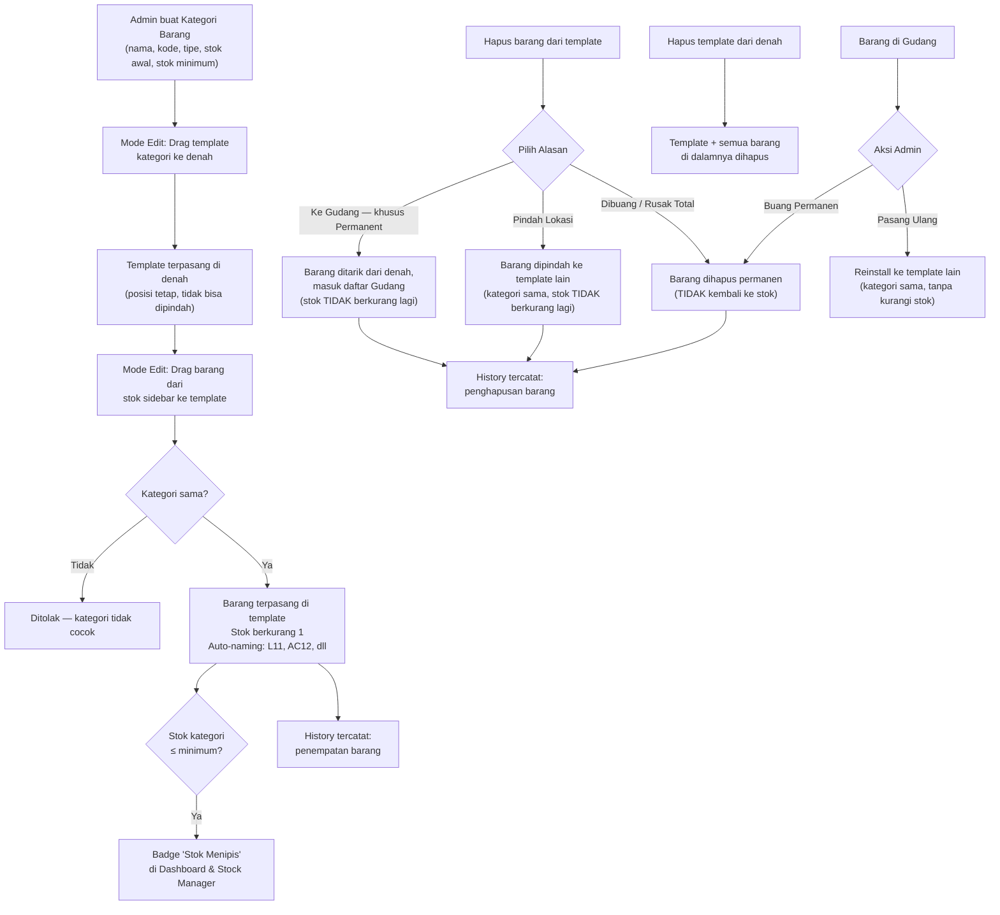

### Dua Tipe Barang

| | Consumable (Sering Diganti) | Permanent (Jarang Diganti) |
|---|---|---|
| **Contoh** | Lampu, Bola Lampu | AC, Meja, CCTV, Dispenser |
| **Diberi ID saat pasang?** | ❌ Tidak (hanya counted) | ✅ Ya (unique ID per unit) |
| **Naming di denah** | `L11` (Lampu, Lt.1, ke-1) | `AC11` (AC, Lt.1, ke-1) |
| **Tracking** | Jumlah per template | Individual per unit |
| **Stok** | Berkurang saat pasang | Berkurang saat pasang |
| **Kondisi & Gudang** | ❌ Tidak berlaku | ✅ Punya status kondisi (Baik/Perlu Cek/Rusak), bisa ditarik ke Gudang |

### Auto-Naming Format

```
{KodeKategori}{NomorLantai}{NomorUrut}

Contoh:
- L11  = Lampu, Lantai 1, nomor 1
- L12  = Lampu, Lantai 1, nomor 2
- AC21 = AC, Lantai 2, nomor 1
- CCTV31 = CCTV, Lantai 3, nomor 1
```

Nomor urut di-increment per kategori per lantai secara otomatis.

### Alasan Penghapusan Barang dari Template (BARU)

Saat admin menghapus barang dari template di Mode Edit, sistem akan meminta **alasan** — bukan langsung hapus begitu saja:

| Alasan | Berlaku untuk | Efek ke Stok | Efek ke Barang |
|---|---|---|---|
| **Dibuang / Rusak Total** | Consumable & Permanent | Tidak kembali (hilang permanen) | Item dihapus dari sistem |
| **Pindah Lokasi** | Consumable & Permanent | Tidak berkurang lagi (dianggap barang yang sama) | Item dipindah ke template lain (kategori harus sama) |
| **Ke Gudang** | Khusus Permanent | Tidak berkurang lagi | Item ditarik dari denah, masuk daftar **Gudang** (lihat bawah), belum dihapus |

Setiap alasan tetap tercatat di History dengan `action_type` yang berbeda (`item_disposed`, `item_relocated`, `item_to_warehouse`) supaya jelas kenapa suatu barang hilang dari denah.

### Stok Minimum & Peringatan Restock (BARU)

Setiap kategori punya field **Stok Minimum** (diisi admin saat buat/edit kategori, default 0 = tidak ada peringatan). Ketika `stock_quantity` kategori turun **≤ stok minimum**:
- Muncul badge merah **"Stok Menipis"** di baris kategori tersebut (Stock Manager & Dashboard).
- Dashboard menampilkan ringkasan **"Kategori Perlu Restock"** — daftar semua kategori yang saat ini di bawah/sama dengan ambang batas.
- Peringatan ini murni indikator visual (tidak memblokir apa pun), beda dengan stok = 0 yang tetap memblokir penempatan barang.

### Kondisi Barang & Gudang — Khusus Permanent (BARU)

Barang tipe **Permanent** (AC, CCTV, Dispenser, dll) punya field **Kondisi** dengan 3 status, bisa diubah admin kapan saja lewat klik marker di denah (View Mode atau Edit Mode):

| Status | Arti | Warna Badge |
|---|---|---|
| **Baik** | Berfungsi normal | Hijau |
| **Perlu Cek** | Ada indikasi masalah, belum dipastikan | Kuning |
| **Rusak** | Dipastikan rusak / butuh servis | Merah |

Jika kondisi diubah/ditandai **Rusak**, admin bisa menarik barang tersebut **ke Gudang** langsung dari popup marker (tombol "Tarik ke Gudang") — ini men-trigger alasan penghapusan "Ke Gudang" di atas. Barang tidak hilang dari sistem, hanya lepas dari template dan pindah ke halaman baru **"Gudang"** yang berisi daftar semua barang permanent yang sedang tidak terpasang di denah (kondisi, tanggal ditarik, dari lokasi mana). Dari halaman Gudang, admin bisa:
- **Pasang Ulang** → drag/assign barang tersebut ke template lain berkategori sama (kondisi otomatis di-reset jadi "Baik" jika sudah diperbaiki, atau tetap sesuai kondisi terakhir jika admin tidak mengubahnya). Tidak mengurangi stok lagi karena barang ini memang sudah tercatat sebagai unit yang sama.
- **Buang Permanen** → barang dihapus total dari sistem (setara alasan "Dibuang / Rusak Total").

### Laporan Berkala Otomatis (BARU)

Selain export manual dari Halaman History, sistem akan membuat **laporan berkala otomatis** (scheduled job, mis. tiap awal bulan) berisi:
- Ringkasan stok saat ini per kategori (termasuk yang di bawah stok minimum)
- Ringkasan pergerakan stok (masuk/keluar) selama periode berjalan
- Daftar barang permanent yang statusnya "Rusak" / sedang di Gudang

Laporan disimpan dalam format PDF & CSV di server (folder `/reports`, bisa diunduh dari halaman baru **"Laporan"**), sehingga admin tidak perlu selalu export manual tiap butuh laporan berkala.

> [!NOTE]
> Fitur yang **tidak** ditambahkan (sudah didiskusikan, sengaja tidak diperlukan untuk saat ini): role/hak akses bertingkat (Admin vs Viewer), bulk placement (pasang barang massal sekaligus), dan history khusus perubahan denah (tambah/hapus template/kategori). Bisa ditambahkan lagi nanti kalau kebutuhannya berubah.

---

## Project Structure

```
Spil Denah/
├── docker-compose.yml
├── .env
├── .env.example
├── README.md
│
├── backend/
│   ├── Dockerfile
│   ├── requirements.txt
│   ├── alembic.ini
│   ├── alembic/
│   │   ├── env.py
│   │   ├── script.py.mako
│   │   └── versions/
│   │       └── 001_initial_migration.py
│   └── app/
│       ├── __init__.py
│       ├── main.py                    # FastAPI app entry + CORS + error handler
│       ├── config.py                  # Pydantic Settings
│       ├── database.py                # Async engine + session
│       ├── models/
│       │   ├── __init__.py
│       │   ├── user.py                # User model
│       │   ├── building.py            # Building model
│       │   ├── floor.py               # Floor model
│       │   ├── category.py            # Equipment category (+ stock, + type)
│       │   ├── template.py            # Category template placement on floor
│       │   ├── item.py                # Actual item placed in template
│       │   └── history.py             # Stock movement & action history
│       ├── schemas/
│       │   ├── __init__.py
│       │   ├── user.py
│       │   ├── building.py
│       │   ├── floor.py
│       │   ├── category.py
│       │   ├── template.py
│       │   ├── item.py
│       │   ├── history.py
│       │   └── export.py
│       ├── api/
│       │   ├── __init__.py
│       │   ├── deps.py                # Dependencies (get_db, get_current_user)
│       │   ├── auth.py                # Login, register, forgot password
│       │   ├── health.py              # Health check endpoint
│       │   ├── buildings.py           # Building CRUD
│       │   ├── floors.py              # Floor CRUD + image upload
│       │   ├── categories.py          # Category CRUD + stock management
│       │   ├── templates.py           # Template placement on floor
│       │   ├── items.py               # Item placement into templates
│       │   ├── history.py             # History log queries
│       │   └── export.py              # Data export (CSV/PDF)
│       ├── services/
│       │   ├── __init__.py
│       │   ├── auth_service.py        # Password hashing, JWT
│       │   ├── email_service.py       # Password reset emails
│       │   ├── naming_service.py      # Auto-naming: L11, AC12, etc.
│       │   ├── stock_service.py       # Stock management logic
│       │   ├── history_service.py     # History logging
│       │   ├── export_service.py      # CSV/PDF generation
│       │   └── image_service.py       # Image optimization
│       ├── middleware/
│       │   ├── __init__.py
│       │   └── error_handler.py       # Global error handling
│       └── utils/
│           ├── __init__.py
│           ├── security.py            # JWT encode/decode
│           └── sanitizer.py           # Input sanitization
│
├── frontend/
│   ├── Dockerfile
│   ├── nginx.conf
│   ├── package.json
│   ├── vite.config.js
│   ├── index.html
│   ├── public/
│   └── src/
│       ├── main.jsx
│       ├── App.jsx                    # React.lazy + ErrorBoundary + routing
│       ├── App.css
│       ├── index.css                  # Modern Enterprise design system
│       │
│       ├── api/
│       │   ├── axios.js               # Axios instance
│       │   ├── auth.js                # Auth + forgot password
│       │   ├── floors.js              # Floor CRUD
│       │   ├── categories.js          # Category + stock management
│       │   ├── templates.js           # Template placement
│       │   ├── items.js               # Item placement
│       │   ├── history.js             # History queries
│       │   └── export.js              # CSV/PDF export
│       │
│       ├── contexts/
│       │   ├── AuthContext.jsx
│       │   └── ToastContext.jsx
│       │
│       ├── components/
│       │   ├── ProtectedRoute.jsx
│       │   ├── Layout/
│       │   │   ├── MainLayout.jsx          # Dashboard layout (view mode)
│       │   │   ├── EditModeLayout.jsx      # Full edit mode layout
│       │   │   ├── LeftSidebar.jsx         # View: floor select + category filter
│       │   │   ├── RightSidebar.jsx        # View: item list on current floor
│       │   │   ├── EditSidebar.jsx         # Edit: template + stock drag source
│       │   │   └── Header.jsx             # Top bar
│       │   ├── Canvas/
│       │   │   ├── FloorCanvas.jsx         # Konva Stage (view + edit)
│       │   │   ├── CanvasControls.jsx      # Zoom/pan controls
│       │   │   ├── Minimap.jsx
│       │   │   ├── TemplateMarker.jsx      # Template slot on canvas
│       │   │   ├── ItemMarker.jsx          # Item placed in template
│       │   │   └── MarkerPopup.jsx         # Info popup
│       │   ├── Category/
│       │   │   ├── CategoryForm.jsx        # Add/edit category + stock
│       │   │   └── StockManager.jsx        # Add stock modal
│       │   ├── Floor/
│       │   │   ├── FloorSwitcher.jsx
│       │   │   └── FloorForm.jsx
│       │   ├── History/
│       │   │   ├── StockHistoryTable.jsx   # Gambar 1: stock in/out log
│       │   │   └── InventoryTable.jsx      # Gambar 2: per-floor item counts
│       │   ├── Management/
│       │   │   └── BottomManagementBar.jsx
│       │   └── UI/
│       │       ├── Modal.jsx
│       │       ├── Button.jsx
│       │       ├── Input.jsx
│       │       ├── Badge.jsx
│       │       ├── FileUpload.jsx
│       │       ├── Toast.jsx
│       │       ├── ConfirmDialog.jsx
│       │       ├── Skeleton.jsx
│       │       └── ErrorBoundary.jsx
│       │
│       └── pages/
│           ├── LoginPage.jsx
│           ├── ForgotPasswordPage.jsx
│           ├── DashboardPage.jsx       # View mode (filter + view items)
│           └── HistoryPage.jsx         # Stock history + inventory tables
│
└── assets/
    └── icons/
```

---

## Database Schema

### ERD Diagram

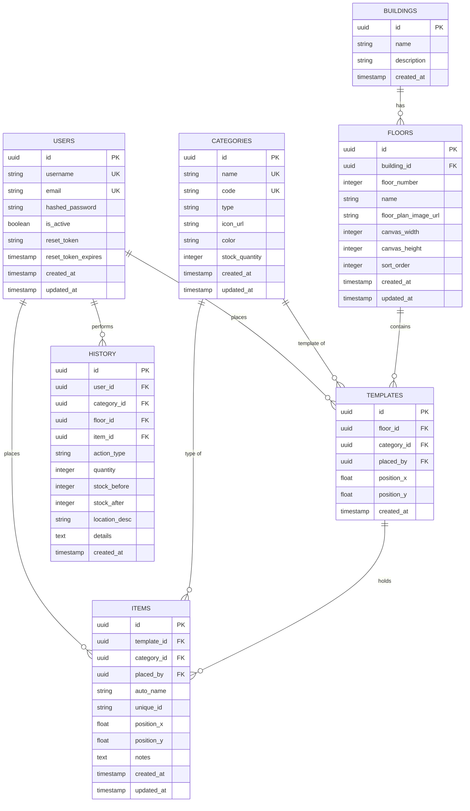

### Table Details

#### `users`
| Column | Type | Constraint | Description |
|--------|------|-----------|-------------|
| id | UUID | PK | Primary key |
| username | VARCHAR(50) | UNIQUE, NOT NULL | Login username |
| email | VARCHAR(100) | UNIQUE, NOT NULL | User email |
| hashed_password | VARCHAR(255) | NOT NULL | Bcrypt hashed |
| is_active | BOOLEAN | DEFAULT true | Account status |
| reset_token | VARCHAR(255) | NULLABLE | Password reset token |
| reset_token_expires | TIMESTAMP | NULLABLE | Token expiry |
| created_at | TIMESTAMP | DEFAULT now() | |
| updated_at | TIMESTAMP | DEFAULT now() | |

#### `buildings`
| Column | Type | Constraint | Description |
|--------|------|-----------|-------------|
| id | UUID | PK | Primary key |
| name | VARCHAR(100) | NOT NULL | Building name |
| description | TEXT | NULLABLE | Description |
| created_at | TIMESTAMP | DEFAULT now() | |

#### `floors`
| Column | Type | Constraint | Description |
|--------|------|-----------|-------------|
| id | UUID | PK | Primary key |
| building_id | UUID | FK → buildings.id | Parent building |
| floor_number | INTEGER | NOT NULL | Floor number |
| name | VARCHAR(50) | NOT NULL | Display name |
| floor_plan_image_url | VARCHAR(500) | NULLABLE | Floor plan image path |
| canvas_width | INTEGER | DEFAULT 1200 | Auto-detected from image |
| canvas_height | INTEGER | DEFAULT 800 | Auto-detected from image |
| sort_order | INTEGER | DEFAULT 0 | Display order |
| created_at | TIMESTAMP | DEFAULT now() | |
| updated_at | TIMESTAMP | DEFAULT now() | |

#### `categories` (BERUBAH BESAR)
| Column | Type | Constraint | Description |
|--------|------|-----------|-------------|
| id | UUID | PK | Primary key |
| name | VARCHAR(100) | UNIQUE, NOT NULL | Full name (e.g., "Lampu LED T5 8W") |
| code | VARCHAR(10) | UNIQUE, NOT NULL | Short code, **auto-generated** (e.g., "L", "AC", "CCTV") |
| type | VARCHAR(20) | NOT NULL | `'consumable'` (sering diganti) or `'permanent'` (jarang diganti) |
| icon_url | VARCHAR(500) | NULLABLE | SVG icon path |
| color | VARCHAR(7) | DEFAULT '#005e02' | Hex color for markers — default sama dengan warna brand aplikasi |
| stock_quantity | INTEGER | DEFAULT 0, NOT NULL | Current stock available |
| min_stock | INTEGER | DEFAULT 0, NOT NULL | **BARU** — ambang batas stok minimum untuk peringatan restock (0 = tidak ada peringatan) |
| created_at | TIMESTAMP | DEFAULT now() | |
| updated_at | TIMESTAMP | DEFAULT now() | |

#### `templates` (BARU — template penempatan kategori di denah)
| Column | Type | Constraint | Description |
|--------|------|-----------|-------------|
| id | UUID | PK | Primary key |
| floor_id | UUID | FK → floors.id | Which floor |
| category_id | UUID | FK → categories.id | Which category this template accepts |
| placed_by | UUID | FK → users.id | Who placed it |
| position_x | FLOAT | NOT NULL | Fixed X position on canvas |
| position_y | FLOAT | NOT NULL | Fixed Y position on canvas |
| created_at | TIMESTAMP | DEFAULT now() | |

> [!NOTE]
> Template **tidak bisa dipindah** setelah ditempatkan. Hanya bisa dihapus (cascade delete semua items di dalamnya).

#### `items` (BARU — barang aktual yang dipasang di template)
| Column | Type | Constraint | Description |
|--------|------|-----------|-------------|
| id | UUID | PK | Primary key |
| template_id | UUID | FK → templates.id, **NULLABLE** | Which template slot — **NULL jika status "gudang"** |
| category_id | UUID | FK → categories.id | Must match template's category |
| placed_by | UUID | FK → users.id | Who placed it |
| auto_name | VARCHAR(20) | NOT NULL | Auto-generated: "L11", "AC21" |
| unique_id | VARCHAR(50) | NULLABLE | Only for `permanent` type — manual or auto ID |
| position_x | FLOAT | NULLABLE | Position within/near template (NULL jika di gudang) |
| position_y | FLOAT | NULLABLE | Position within/near template (NULL jika di gudang) |
| condition | VARCHAR(20) | DEFAULT 'baik' | **BARU** — khusus `permanent`: `'baik'` / `'perlu_cek'` / `'rusak'` |
| location_status | VARCHAR(20) | DEFAULT 'terpasang' | **BARU** — `'terpasang'` (di denah) atau `'gudang'` (ditarik, khusus `permanent`) |
| warehouse_since | TIMESTAMP | NULLABLE | **BARU** — tanggal ditarik ke gudang |
| notes | TEXT | NULLABLE | Optional notes |
| created_at | TIMESTAMP | DEFAULT now() | |
| updated_at | TIMESTAMP | DEFAULT now() | |

> [!NOTE]
> - `consumable` items: `unique_id` = NULL (tidak diberi ID unik, hanya counted), `condition` & `location_status` tidak dipakai (selalu `'baik'`/`'terpasang'`)
> - `permanent` items: `unique_id` = assigned saat pemasangan (e.g., "AC-001", auto or manual); punya `condition` & bisa `location_status = 'gudang'`

#### `history` (BARU — pencatatan semua aksi)
| Column | Type | Constraint | Description |
|--------|------|-----------|-------------|
| id | UUID | PK | Primary key |
| user_id | UUID | FK → users.id | Who performed the action |
| category_id | UUID | FK → categories.id, NULLABLE | Related category |
| floor_id | UUID | FK → floors.id, NULLABLE | Related floor |
| item_id | UUID | NULLABLE | Related item (if applicable) |
| action_type | VARCHAR(30) | NOT NULL | See action types below |
| quantity | INTEGER | DEFAULT 1 | Quantity affected |
| stock_before | INTEGER | NULLABLE | Stock count before action |
| stock_after | INTEGER | NULLABLE | Stock count after action |
| location_desc | VARCHAR(200) | NULLABLE | Location description (e.g., "Area kerja lt 3 Enggano") |
| details | TEXT | NULLABLE | JSON or text with additional details |
| created_at | TIMESTAMP | DEFAULT now() | |

**Action Types:**
| action_type | Description | Stock Impact |
|------------|-------------|-------------|
| `stock_in` | Stok barang masuk (ditambah) | stock_before → stock_after (+qty) |
| `stock_out` | Stok barang keluar / ditempatkan di denah | stock_before → stock_after (-qty) |
| `item_placed` | Barang dipasang di template denah | -1 dari stok |
| `item_disposed` | Barang dihapus permanen (alasan: Dibuang/Rusak Total) | Tidak kembali ke stok |
| `item_relocated` | **BARU** — Barang dipindah ke template lain (alasan: Pindah Lokasi) | Tidak ada efek stok |
| `item_to_warehouse` | **BARU** — Barang ditarik ke Gudang (khusus permanent, kondisi Rusak/Perlu Cek) | Tidak ada efek stok |
| `item_reinstalled` | **BARU** — Barang dari Gudang dipasang ulang ke template | Tidak ada efek stok |
| `template_placed` | Template kategori ditempatkan di denah | Tidak ada efek stok |
| `template_removed` | Template dihapus dari denah | Tidak ada efek stok |

### Database Indexes

| Table | Column(s) | Type | Reason |
|-------|-----------|------|--------|
| `items` | `template_id` | B-tree | Query items per template |
| `items` | `category_id` | B-tree | Filter by category |
| `items` | `auto_name` | B-tree | Search by auto-name |
| `templates` | `floor_id` | B-tree | Query templates per floor |
| `templates` | `category_id` | B-tree | Filter by category |
| `categories` | `code` | B-tree | Naming lookup |
| `categories` | `type` | B-tree | Filter consumable/permanent |
| `history` | `category_id` | B-tree | History per category |
| `history` | `floor_id` | B-tree | History per floor |
| `history` | `action_type` | B-tree | Filter by action |
| `history` | `created_at` | B-tree | Sort by date |
| `floors` | `building_id` | B-tree | Query floors per building |
| `users` | `reset_token` | B-tree | Password reset lookup |

---

## API Endpoints

### Health Check

| Method | Endpoint | Description | Auth |
|--------|---------|-------------|------|
| GET | `/api/health` | App status + DB connection | No |

### Authentication

| Method | Endpoint | Description | Auth |
|--------|---------|-------------|------|
| POST | `/api/auth/register` | Register new user | No |
| POST | `/api/auth/login` | Login → JWT tokens | No |
| POST | `/api/auth/refresh` | Refresh access token | Refresh |
| GET | `/api/auth/me` | Current user profile | Bearer |
| POST | `/api/auth/forgot-password` | Send reset email | No |
| POST | `/api/auth/reset-password` | Reset with token | No |

### Buildings

| Method | Endpoint | Description | Auth |
|--------|---------|-------------|------|
| GET | `/api/buildings` | List buildings | Bearer |
| GET | `/api/buildings/{id}` | Building detail + floors | Bearer |
| POST | `/api/buildings` | Create building | Bearer |

### Floors

| Method | Endpoint | Description | Auth |
|--------|---------|-------------|------|
| GET | `/api/buildings/{bid}/floors` | List floors | Bearer |
| GET | `/api/floors/{id}` | Floor detail | Bearer |
| POST | `/api/buildings/{bid}/floors` | Create floor + image | Bearer |
| PUT | `/api/floors/{id}` | Update floor | Bearer |
| DELETE | `/api/floors/{id}` | Delete floor (cascade) | Bearer |
| POST | `/api/floors/{id}/upload-image` | Upload/replace image | Bearer |

### Categories + Stock (BERUBAH)

| Method | Endpoint | Description | Auth |
|--------|---------|-------------|------|
| GET | `/api/categories` | List all categories with stock | Bearer |
| GET | `/api/categories/{id}` | Category detail | Bearer |
| POST | `/api/categories` | Create category (name, code, type, stock) | Bearer |
| PUT | `/api/categories/{id}` | Update category | Bearer |
| DELETE | `/api/categories/{id}` | Delete category | Bearer |
| POST | `/api/categories/{id}/stock` | **Add stock** (quantity, notes) | Bearer |

### Templates (BARU)

| Method | Endpoint | Description | Auth |
|--------|---------|-------------|------|
| GET | `/api/floors/{fid}/templates` | List templates on floor | Bearer |
| POST | `/api/floors/{fid}/templates` | **Place template** (category_id, x, y) | Bearer |
| DELETE | `/api/templates/{id}` | **Delete template** (cascade items) | Bearer |
| GET | `/api/templates/{id}/items` | List items in template | Bearer |

### Items (BARU — menggantikan equipments)

| Method | Endpoint | Description | Auth |
|--------|---------|-------------|------|
| GET | `/api/floors/{fid}/items` | List all items on floor | Bearer |
| POST | `/api/templates/{tid}/items` | **Place item** from stock into template | Bearer |
| PUT | `/api/items/{id}` | Update item (position, notes) | Bearer |
| DELETE | `/api/items/{id}` | **Delete item** (permanent, no stock return) | Bearer |
| GET | `/api/items/summary` | Inventory summary per floor per category (gambar 2) | Bearer |

### History (BARU)

| Method | Endpoint | Description | Auth |
|--------|---------|-------------|------|
| GET | `/api/history` | List all history (paginated, filterable) | Bearer |
| GET | `/api/history/stock` | **Stock movement log** (gambar 1) | Bearer |
| GET | `/api/history/stock?category_id=x` | Filter by category | Bearer |
| GET | `/api/history/stock?floor_id=x` | Filter by floor | Bearer |

### Data Export

| Method | Endpoint | Description | Auth |
|--------|---------|-------------|------|
| GET | `/api/export/inventory?format=csv` | Export inventory summary | Bearer |
| GET | `/api/export/inventory?format=pdf` | Export inventory PDF | Bearer |
| GET | `/api/export/history?format=csv` | Export stock history | Bearer |
| GET | `/api/export/floor/{fid}?format=csv` | Export per floor | Bearer |

### File Upload

| Method | Endpoint | Description | Auth |
|--------|---------|-------------|------|
| POST | `/api/upload/floor-plan` | Upload image (auto-optimized) | Bearer |
| GET | `/api/uploads/{filename}` | Serve static image | No |

---

## Proposed Changes

### 1. Docker & Infrastructure

*(Sama seperti plan sebelumnya — docker-compose.yml, .env.example, 3 services)*

#### [NEW] [docker-compose.yml](file:///Users/macbook-samuel/Documents/coding/Spil%20Denah/docker-compose.yml)
- 3 services: `backend` (FastAPI), `frontend` (React/Nginx), `db` (PostgreSQL 16)
- Shared network, volume for postgres_data + uploads
- Health checks on all services

#### [NEW] [.env.example](file:///Users/macbook-samuel/Documents/coding/Spil%20Denah/.env.example)
```env
POSTGRES_USER=spildenah
POSTGRES_PASSWORD=spildenah_secret_2024
POSTGRES_DB=spildenah_db
DATABASE_URL=postgresql+asyncpg://spildenah:spildenah_secret_2024@db:5432/spildenah_db
SECRET_KEY=your-super-secret-key-change-this
ALGORITHM=HS256
ACCESS_TOKEN_EXPIRE_MINUTES=30
REFRESH_TOKEN_EXPIRE_DAYS=7
FRONTEND_URL=http://localhost:3000
SMTP_HOST=smtp.gmail.com
SMTP_PORT=587
SMTP_USER=
SMTP_PASSWORD=
```

---

### 2. Backend (FastAPI)

#### [NEW] [backend/requirements.txt](file:///Users/macbook-samuel/Documents/coding/Spil%20Denah/backend/requirements.txt)
```text
fastapi==0.115.6
uvicorn[standard]==0.34.0
sqlalchemy[asyncio]==2.0.36
asyncpg==0.30.0
alembic==1.14.1
pydantic==2.10.4
pydantic-settings==2.7.1
python-jose[cryptography]==3.3.0
passlib[bcrypt]==1.7.4
python-multipart==0.0.20
aiofiles==24.1.0
Pillow==11.1.0
bleach==6.2.0
reportlab==4.2.5
aiosmtplib==3.0.2
jinja2==3.1.5
itsdangerous==2.2.0
```

#### [NEW] Backend Models — Key Changes

**[category.py](file:///Users/macbook-samuel/Documents/coding/Spil%20Denah/backend/app/models/category.py)**:
- `type` field: `'consumable'` or `'permanent'` — determines if items get unique IDs
- `stock_quantity` field: tracks available stock
- `code` field: short code for auto-naming (e.g., "L", "AC")

**[template.py](file:///Users/macbook-samuel/Documents/coding/Spil%20Denah/backend/app/models/template.py)**:
- Represents a category "slot" placed on the floor plan
- `position_x`, `position_y`: fixed position (not movable after creation)
- Relationship to `category` and `items`

**[item.py](file:///Users/macbook-samuel/Documents/coding/Spil%20Denah/backend/app/models/item.py)**:
- Actual item placed into a template
- `auto_name`: auto-generated (e.g., "L11")
- `unique_id`: only for permanent type, assigned on placement
- `template_id` FK: must belong to a template
- `category_id` must match template's `category_id` (enforced in API)

**[history.py](file:///Users/macbook-samuel/Documents/coding/Spil%20Denah/backend/app/models/history.py)**:
- Logs every stock/placement action
- `action_type`, `quantity`, `stock_before`, `stock_after`, `location_desc`

#### [NEW] Backend Services — Key New Services

**[naming_service.py](file:///Users/macbook-samuel/Documents/coding/Spil%20Denah/backend/app/services/naming_service.py)**:
- `generate_category_code(category_name, db)` → auto-generate kode kategori (dipanggil saat kategori baru dibuat, **bukan input manual**):
  - Ambil huruf awal tiap kata signifikan dari nama kategori (mis. "Lampu LED T5 8W" → `LT5`, "AC Split 1PK" → `AS1` atau fallback ke 2-4 huruf awal nama jika tidak ada pola jelas, mis. "AC" → `AC`)
  - Uppercase, strip angka satuan (W, PK) dan kata umum jika perlu
  - Cek uniqueness terhadap kode kategori yang sudah ada di DB → jika bentrok, tambahkan angka suffix (mis. `LT5`, `LT5B`, dst.)
  - Kode final ditampilkan sebagai preview read-only di CategoryForm sebelum admin submit
- `generate_auto_name(category_code, floor_number, db)` → e.g., "L11"
- Queries existing items on that floor + category to get next sequence number
- Thread-safe (uses DB sequence or MAX query + 1)

**[stock_service.py](file:///Users/macbook-samuel/Documents/coding/Spil%20Denah/backend/app/services/stock_service.py)**:
- `add_stock(category_id, quantity, user_id, db)` → increases stock, logs history
- `consume_stock(category_id, quantity, user_id, floor_id, location, db)` → decreases stock, logs history
- `check_stock(category_id, quantity)` → returns bool (sufficient stock?)

**[history_service.py](file:///Users/macbook-samuel/Documents/coding/Spil%20Denah/backend/app/services/history_service.py)**:
- `log_action(action_type, user_id, category_id, floor_id, item_id, quantity, stock_before, stock_after, location, details, db)`
- `get_stock_history(filters, pagination, db)` → for gambar 1 table
- `get_inventory_summary(building_id, db)` → for gambar 2 table (per-floor counts per category)

#### [NEW] Backend API — Key Endpoint Logic

**`POST /api/floors/{fid}/templates`** (Place Template):
1. Validate category exists
2. Create template at position (x, y) on floor
3. Log `template_placed` in history
4. Return template data

**`POST /api/templates/{tid}/items`** (Place Item from Stock):
1. Get template → get category
2. **Validate category match** (template's category == request category)
3. **Check stock** ≥ 1
4. Decrease stock by 1
5. **Generate auto_name**: `{code}{floor_number}{next_sequence}`
6. If `permanent` type → assign `unique_id`
7. Create item
8. Log `item_placed` + `stock_out` in history
9. Return item with auto_name

**`DELETE /api/items/{id}`** (Remove Item):
1. Get item data
2. Delete item permanently
3. **Stock does NOT increase** (barang hilang)
4. Log `item_removed` in history

**`POST /api/categories/{id}/stock`** (Add Stock):
1. Validate category exists
2. Increase `stock_quantity` by given amount
3. Log `stock_in` in history with `stock_before` and `stock_after`

*(Semua endpoint lain — auth, buildings, floors, health, export, error handler, image optimization, input sanitizer — **tetap sama** seperti plan sebelumnya)*

---

### 3. Frontend — Layout Perubahan Besar

#### Dua Mode Tampilan

```
📋 VIEW MODE (Dashboard)              ✏️ EDIT MODE (Full Screen)
┌──────────────────────────────┐      ┌──────────────────────────────┐
│  Header [View Mode]  [Exit]  │      │  Header [EDIT MODE]  [Save]  │
├────────┬─────────────┬───────┤      ├─────────────┬────────────────┤
│        │             │       │      │             │                │
│ Left   │   Floor     │ Right │      │   Edit      │   Floor        │
│Sidebar │   Canvas    │Sidebar│      │  Sidebar    │   Canvas       │
│        │             │       │      │  (280px)    │   (flexible)   │
│-Floor  │  templates  │-Item  │      │             │                │
│ Select │  + items    │ List  │      │ -Category   │  - Templates   │
│-Search │  (view only)│ on    │      │  Templates  │  - Items       │
│-Filter │             │ floor │      │  (drag)     │  - Drop zones  │
│ Categ. │             │       │      │ -Stock      │  - Drag here   │
│        │             │       │      │  Items      │                │
│        │             │       │      │  (drag)     │                │
├────────┴─────────────┴───────┤      ├─────────────┴────────────────┤
│ ⚙ Management Bar             │      │ Edit toolbar (undo, delete)  │
└──────────────────────────────┘      └──────────────────────────────┘
```

#### [MODIFY] [MainLayout.jsx](file:///Users/macbook-samuel/Documents/coding/Spil%20Denah/frontend/src/components/Layout/MainLayout.jsx)
**VIEW MODE layout** (Dashboard):

**Desktop (≥ 1024px)**: Three columns
- **Left sidebar (280px)**: Floor selector + Search bar + Category filter chips
- **Canvas (flexible)**: Floor plan with templates + items (view only, no edit)
- **Right sidebar (300px)**: List of all items on current floor (simple list)

**Mobile (< 768px)**: Single column + drawers (same responsive pattern as before)

#### [NEW] [EditModeLayout.jsx](file:///Users/macbook-samuel/Documents/coding/Spil%20Denah/frontend/src/components/Layout/EditModeLayout.jsx)
**EDIT MODE layout** — replaces entire dashboard when edit mode activated:

**Desktop**: Two columns
- **Edit Sidebar (300px, fixed left)**: 
  - Section 1: **Category Templates** — draggable template cards for each category
  - Section 2: **Stock Items** — draggable item cards showing available stock per category
  - Stock count shown on each card (e.g., "Lampu LED T5 8W — Stok: 7")
  - Items grayed out if stock = 0
- **Canvas (flexible)**: Floor plan with drop zones
  - Can drop templates onto empty canvas space
  - Can drop items onto matching templates
  - Templates show as dashed-border squares with category icon
  - Items show as filled markers inside/near templates

**Mobile**: Full-screen canvas with bottom sheet for edit sidebar

**Entering Edit Mode**: Click "✏️ Edit Penempatan" on Bottom Management Bar → dashboard transforms to edit mode
**Exiting Edit Mode**: Click "✅ Selesai" button in header → returns to dashboard view mode

#### [MODIFY] [LeftSidebar.jsx](file:///Users/macbook-samuel/Documents/coding/Spil%20Denah/frontend/src/components/Layout/LeftSidebar.jsx)
**VIEW MODE only** — now purely for filtering:
- **Floor Selector**: Vertical list of floors (same as before)
- **Search Bar**: Search items by auto_name or category name
- **Category Filter**: Toggleable category chips with icons
  - Toggle ON = show only that category's items/templates on canvas
  - Toggle ALL = show everything
  - "Select All" / "Clear" buttons
  - Each chip shows: icon + name + count on this floor
- **NO item list here** (moved to right sidebar)

#### [MODIFY] [RightSidebar.jsx](file:///Users/macbook-samuel/Documents/coding/Spil%20Denah/frontend/src/components/Layout/RightSidebar.jsx)
**VIEW MODE only** — simplified to item list:
- **Title**: "Daftar Barang Lantai {N}"
- **Item list**: All items on current floor, grouped by category
  - Each group header: category icon + name + count
  - Each item: auto_name (e.g., "L11"), unique_id if permanent, placement date
  - Click item → canvas pans/zooms to that item's position
- **No stats cards, no expiry alerts** (removed)

#### [NEW] [EditSidebar.jsx](file:///Users/macbook-samuel/Documents/coding/Spil%20Denah/frontend/src/components/Layout/EditSidebar.jsx)
**EDIT MODE only** — source for drag-and-drop:

**Section 1: Template Kategori** (drag to canvas empty space)
```
┌─────────────────────────────┐
│ 📋 Template Kategori         │
├─────────────────────────────┤
│ ┌─────────────────────────┐ │
│ │ 💡 Lampu LED T5 8W      │ │  ← drag this to canvas
│ │    [template icon]       │ │
│ └─────────────────────────┘ │
│ ┌─────────────────────────┐ │
│ │ ❄️ AC Split 1PK          │ │  ← drag this to canvas
│ │    [template icon]       │ │
│ └─────────────────────────┘ │
│ ┌─────────────────────────┐ │
│ │ 📹 CCTV Indoor           │ │  ← drag this to canvas
│ └─────────────────────────┘ │
│  ... more categories ...    │
└─────────────────────────────┘
```

**Section 2: Stok Barang** (drag to matching template on canvas)
```
┌─────────────────────────────┐
│ 📦 Stok Barang               │
├─────────────────────────────┤
│ ┌─────────────────────────┐ │
│ │ 💡 Lampu LED T5 8W      │ │  ← drag to Lampu template
│ │    Stok: 7              │ │
│ └─────────────────────────┘ │
│ ┌─────────────────────────┐ │
│ │ ❄️ AC Split 1PK          │ │  ← drag to AC template
│ │    Stok: 3              │ │
│ └─────────────────────────┘ │
│ ┌─────────────────────────┐ │
│ │ 🪑 Meja Staff            │ │  ← GRAYED OUT
│ │    Stok: 0 (habis)      │ │
│ └─────────────────────────┘ │
└─────────────────────────────┘
```

- Uses **HTML5 Drag and Drop** or **react-dnd** for drag operations
- Visual feedback: ghost image while dragging, drop zone highlights
- Category match validation: drop rejected with toast if category mismatch

#### [MODIFY] [Header.jsx](file:///Users/macbook-samuel/Documents/coding/Spil%20Denah/frontend/src/components/Layout/Header.jsx)
- **View Mode**: Logo + title + building name + user + logout + "📊 History" link
- **Edit Mode**: Logo + "✏️ MODE EDIT" badge (`--color-primary` #005e02) + current floor name + "✅ Selesai" button

---

### 4. Canvas Components — Changes

#### [MODIFY] [FloorCanvas.jsx](file:///Users/macbook-samuel/Documents/coding/Spil%20Denah/frontend/src/components/Canvas/FloorCanvas.jsx)

**View Mode**:
- Shows templates as category-colored squares/circles with icon
- Shows items as small markers inside/near templates with auto_name label
- Click template → show template info popup
- Click item → show item info popup
- Filter by category from LeftSidebar
- Zoom/pan same as before

**Edit Mode**:
- **Drop zone for templates**: Drag template from EditSidebar → drop on empty canvas space → `POST /api/floors/{fid}/templates`
- **Drop zone for items**: Drag stock item from EditSidebar → drop on matching template → `POST /api/templates/{tid}/items`
- **Category validation on drop**: If item category ≠ template category → reject with toast "Kategori tidak cocok!"
- **Template markers**: Dashed border, can't be moved, can be deleted (right-click → delete)
- **Item markers**: Can be moved within template area (drag), can be deleted (right-click → delete)
- **Visual cue**: When dragging a stock item, matching templates glow/highlight. Non-matching templates stay dim.

#### [NEW] [TemplateMarker.jsx](file:///Users/macbook-samuel/Documents/coding/Spil%20Denah/frontend/src/components/Canvas/TemplateMarker.jsx)
- Konva `<Group>` representing a category template slot on canvas
- **Appearance**: Dashed border rectangle/circle + category icon + category name
- **Color**: Category's color with 30% opacity fill
- **States**:
  - Empty (no items): dashed border, muted
  - Has items: solid border, bright
  - Hover in edit mode: highlight glow
  - Drop target active: pulsing border animation
- **Not draggable** (fixed position)
- **Context menu (edit mode)**: Delete template → ConfirmDialog → cascade delete items

#### [NEW] [ItemMarker.jsx](file:///Users/macbook-samuel/Documents/coding/Spil%20Denah/frontend/src/components/Canvas/ItemMarker.jsx)
- Konva `<Group>` representing an actual item placed in a template
- **Appearance**: Solid circle with category color + auto_name text label (e.g., "L11")
- **Consumable type**: Small dot marker, minimal
- **Permanent type**: Larger marker with unique_id badge
- **Draggable in edit mode** (can reposition within template area)
- **Context menu (edit mode)**: Delete item → ConfirmDialog
- **View mode**: Click → popup with item details

#### [MODIFY] [MarkerPopup.jsx](file:///Users/macbook-samuel/Documents/coding/Spil%20Denah/frontend/src/components/Canvas/MarkerPopup.jsx)
- **For template**: Shows category name, number of items inside, placed date, placed by
- **For item**: Shows auto_name, category, unique_id (if permanent), placed date, notes
- **Edit mode**: Shows Delete button (no Edit button since data is minimal)
- **Mobile**: Bottom card (same responsive pattern)

---

### 5. Category + Stock Management

#### [MODIFY] [CategoryForm.jsx](file:///Users/macbook-samuel/Documents/coding/Spil%20Denah/frontend/src/components/Category/CategoryForm.jsx)
Clean modern modal — now includes stock and type:
- **Fields**:
  - Category Name (e.g., "Lampu LED T5 8W", "AC Split 1PK")
  - ~~Category Code~~ — **dihapus dari form**, kode dibuat **otomatis oleh sistem** (auto-generate) dari nama kategori saat submit, tidak di-input manual oleh admin. Preview kode yang akan dihasilkan ditampilkan read-only di form (mis. "Lampu LED T5 8W" → `LT5`) agar admin bisa lihat sebelum simpan.
  - Type: `consumable` (sering diganti) or `permanent` (jarang diganti) — radio buttons
  - Icon selection
  - Color picker
  - **Initial Stock Quantity** (number input, e.g., 50)
  - **Stok Minimum** (number input, default 0) — **BARU**, untuk trigger badge "Stok Menipis"
  - Type = `permanent` → tampilkan opsi tambahan **Kondisi awal** (default "Baik") saat item dipasang nanti — **BARU**
- On submit → `POST /api/categories` (backend generate kode via `naming_service.generate_category_code()`)

#### [NEW] [StockManager.jsx](file:///Users/macbook-samuel/Documents/coding/Spil%20Denah/frontend/src/components/Category/StockManager.jsx)
Modal for adding stock to existing category:
- Shows current stock count
- Input: quantity to add
- Optional: notes / keterangan
- On submit → `POST /api/categories/{id}/stock` → toast "Stok berhasil ditambahkan"
- Updates stock count immediately in EditSidebar

---

### 6. History Components (BARU)

#### [NEW] [HistoryPage.jsx](file:///Users/macbook-samuel/Documents/coding/Spil%20Denah/frontend/src/pages/HistoryPage.jsx)
Full page with two tabs:

**Tab 1: Riwayat Stok** (gambar 1)
- Table like the spreadsheet in gambar 1
- Columns: No, Tanggal, then for each category: Masuk | Keluar + Sisa Stock
- Rows: each stock movement, with location description
- Filters: date range, category, floor
- Pagination
- Export CSV/PDF button

**Tab 2: Inventaris Barang** (gambar 2)
- Table showing current inventory counts per floor per category
- Columns: Category names (AC, CCTV, Dispenser, etc.)
- Rows: Each floor
- Last row: Total
- Color-coded cells (header `--color-primary` #005e02, mengikuti struktur gambar 2 tapi warna disamakan dengan brand)
- Export CSV/PDF button

#### [NEW] [StockHistoryTable.jsx](file:///Users/macbook-samuel/Documents/coding/Spil%20Denah/frontend/src/components/History/StockHistoryTable.jsx)
- Clean card-based table with scrollable horizontal overflow
- Date column (sticky left)
- Category columns with sub-columns Masuk (`--color-success`, teal) + Keluar (red)
- Sisa Stock shown per category
- Location column (sticky right)
- Responsive: horizontal scroll on mobile

#### [NEW] [InventoryTable.jsx](file:///Users/macbook-samuel/Documents/coding/Spil%20Denah/frontend/src/components/History/InventoryTable.jsx)
- Grid/table showing item counts per floor per category
- Header `--color-primary` (#005e02) theme (struktur mengikuti gambar 2, warna disamakan dengan brand color)
- Rows per floor, total row at bottom
- Click cell → navigate to that floor with that category filtered

---

### 7. Bottom Management Bar — Updated

#### [MODIFY] [BottomManagementBar.jsx](file:///Users/macbook-samuel/Documents/coding/Spil%20Denah/frontend/src/components/Management/BottomManagementBar.jsx)

**Updated 4 Action Buttons**:

1. **🗺️ + Tambah Lantai Baru** — same as before
2. **📦 + Kategori & Stok** — opens CategoryForm (with stock management)
   - Also has "Kelola Stok" option → opens StockManager for existing categories
3. **✏️ Edit Penempatan** (Toggle) — now switches entire layout to EditModeLayout
4. **📊 History** — navigates to HistoryPage

*(Hide/unhide mechanism remains the same)*

---

### 8. UX Flows

#### Flow 1: Login
*(Same as before)*

#### Flow 2: Create Category + Stock
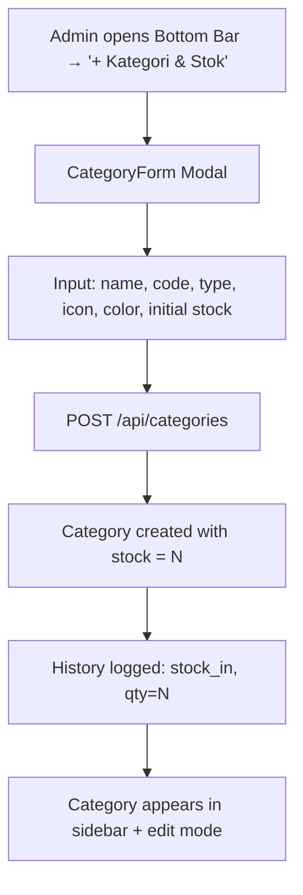

#### Flow 3: Place Template on Floor (Edit Mode)
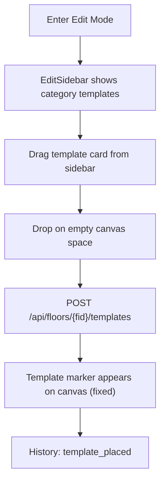

#### Flow 4: Place Item from Stock into Template (Edit Mode)
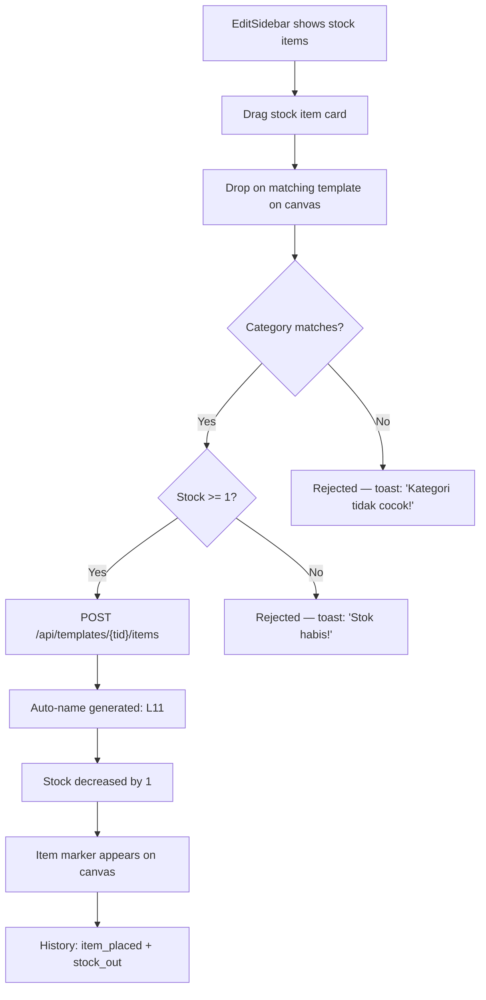

#### Flow 5: Delete/Pindahkan Item (UPDATED)
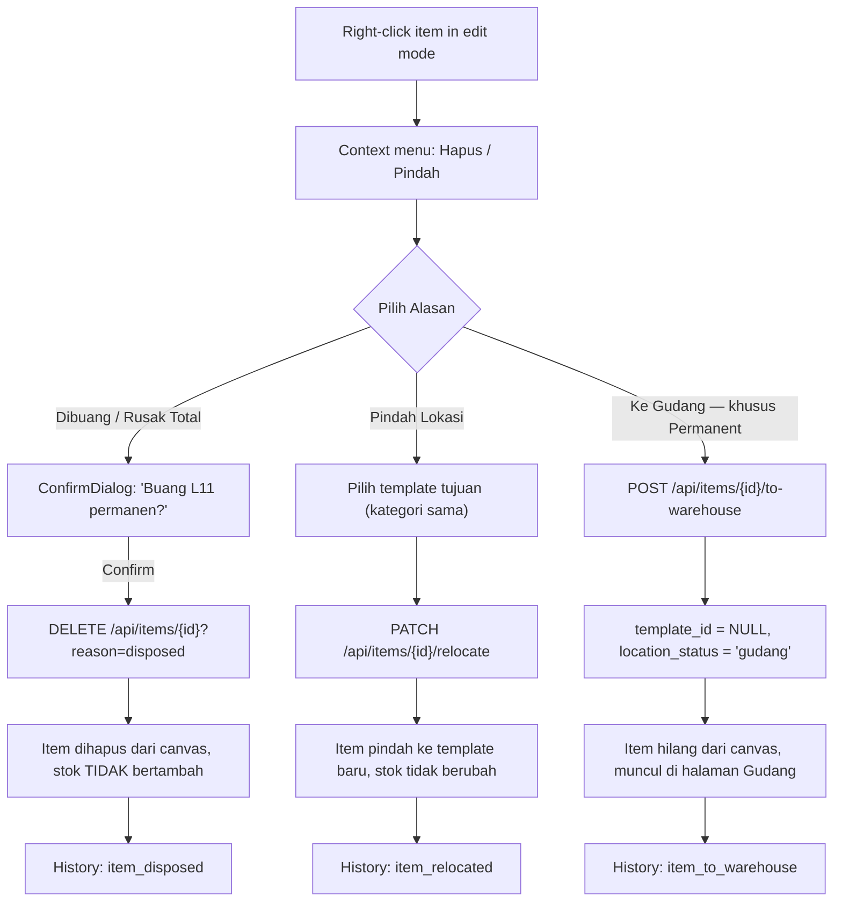

#### Flow 5b: Gudang — Pasang Ulang / Buang Permanen (BARU)
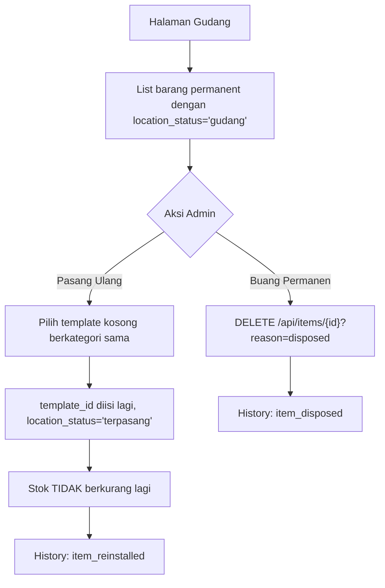

#### Flow 6: Add Stock
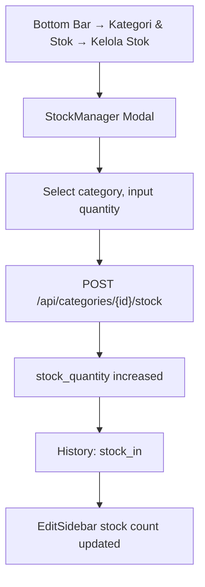

#### Flow 7: View History (Gambar 1 + 2)
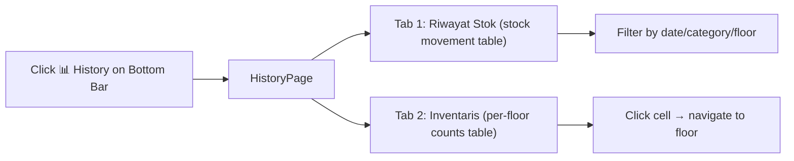

#### Flow 8: Peringatan Stok Minimum (BARU)
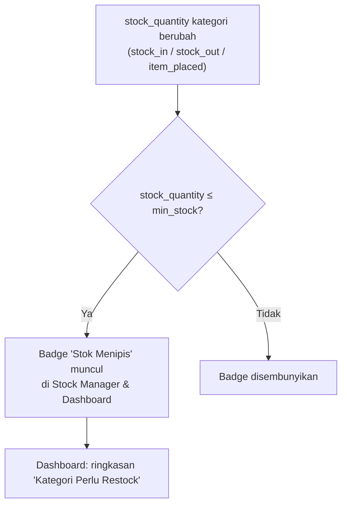

#### Flow 9: Laporan Berkala Otomatis (BARU)
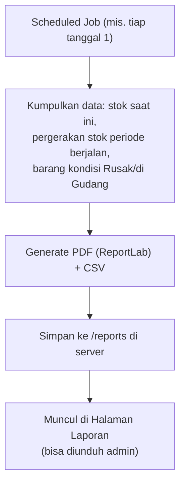

---

### 9. What's REMOVED from Previous Plan

| Removed Feature | Reason |
|----------------|--------|
| Expiry date tracking (`expiry_date`, `lifespan_months`) | Diganti dengan inventory/stock system |
| Equipment detail form (brand, model, serial, installation date) | Diganti auto-naming, data minimal |
| Right sidebar expiring alerts | Diganti list barang per lantai |
| Detailed MarkerPopup (brand, model, dates, remaining days) | Simplified — hanya auto_name + category |
| Status badges (active/warning/expired) | Tidak ada expiry tracking |
| `equipments` table | Diganti `templates` + `items` tables |
| Direct click-to-place on canvas | Diganti drag-and-drop dari sidebar |
| Equipment can be moved freely | Templates fixed, items movable only |

### 10.5 What's ADDED — Rekomendasi Cara Kerja (BARU, dari diskusi user review)

| Fitur Baru | Lokasi | Ringkasan |
|-------------|--------|-----------|
| Alasan saat hapus barang | Context menu item + `items` table (`location_status`) | Dibuang / Pindah Lokasi / Ke Gudang — bukan langsung hapus |
| Stok minimum & peringatan restock | `categories.min_stock` + Dashboard/Stock Manager | Badge "Stok Menipis" saat stok ≤ ambang batas |
| Kondisi barang (khusus Permanent) | `items.condition` + MarkerPopup | Baik / Perlu Cek / Rusak, badge warna di marker |
| Halaman Gudang (khusus Permanent) | Halaman baru "Gudang" | Barang ditarik dari denah (kondisi Rusak/Perlu Cek), bisa dipasang ulang atau dibuang permanen |
| Laporan berkala otomatis | Scheduled job + Halaman "Laporan" | PDF/CSV otomatis (mis. bulanan) tanpa perlu export manual tiap saat |

> [!NOTE]
> Dipertimbangkan tapi **sengaja tidak ditambahkan** saat ini: role/hak akses bertingkat (Admin vs Viewer), bulk placement (pasang barang massal), dan history khusus perubahan denah (tambah/hapus template/kategori/gambar). Bisa diusulkan lagi nanti kalau kebutuhan berkembang (misalnya sudah dipakai lebih dari satu orang).


### 10. What's KEPT from Previous Plan

| Kept Feature | Location |
|-------------|----------|
| Modern Enterprise UI design system | index.css — **primary color diperbarui ke `#005e02`**, lihat bagian Design System — Warna |
| Responsive design (mobile/tablet/desktop) | All layouts |
| Docker + Docker Compose | Infrastructure |
| FastAPI + PostgreSQL + React | Tech stack |
| JWT auth + forgot password | Auth system |
| Floor management (add/delete/upload image) | Floor components |
| Zoom/pan/minimap canvas | Canvas components |
| Toast notifications | UI/Toast.jsx |
| Confirmation dialogs | UI/ConfirmDialog.jsx |
| Loading skeletons | UI/Skeleton.jsx |
| Error boundary | UI/ErrorBoundary.jsx |
| React lazy loading | App.jsx |
| Data export CSV/PDF | Export endpoints |
| Print floor plan | Canvas export |
| Health check endpoint | /api/health |
| Global error handling | middleware |
| Input sanitization | sanitizer |
| Image optimization | image_service |
| Database indexing | Alembic migration |
| Bottom Management Bar (hide/unhide) | Management |
| Gzip + Security headers | nginx.conf |

---

## Visual Design Reference

### Design System — Warna (BARU, agar konsisten & rapi di semua komponen)

Warna utama aplikasi adalah **`#005e02`** (hijau tua). Semua elemen UI yang bersifat *brand/primary action* — tombol utama, link aktif, badge mode edit, border highlight, header tabel, drop-zone saat drag, focus ring input, ikon aktif di navigasi — **wajib memakai token warna yang sama ini**, bukan warna acak per komponen (mis. ungu di tabel inventaris atau indigo di marker default sebelumnya).

**CSS Variables (`index.css`)** — satu sumber kebenaran warna, tidak boleh hardcode hex di komponen lain:
```css
:root {
  /* Primary — brand color */
  --color-primary: #005e02;
  --color-primary-dark: #004201;   /* hover/active state tombol & link */
  --color-primary-light: #e2f0e2;  /* background badge/highlight ringan */
  --color-primary-50: #f1f8f1;     /* background section terpilih, drop-zone */

  /* Semantic — tetap terpisah dari primary, jangan dicampur */
  --color-success: #0d9488;   /* teal, sengaja BUKAN hijau agar tidak tertukar visual dengan primary */
  --color-warning: #d97706;   /* Stok Menipis / kondisi Perlu Cek */
  --color-danger:  #dc2626;   /* stock_out permanen / kondisi Rusak / reject */

  /* Neutral */
  --color-text: #1e293b;
  --color-text-muted: #64748b;
  --color-border: #e2e8f0;
  --color-surface: #ffffff;
  --color-background: #f8fafc;
}
```

**Aturan pemakaian konsisten:**

| Elemen | Warna | Catatan |
|---|---|---|
| Tombol utama (Simpan, Tambah, Pasang) | `--color-primary`, hover `--color-primary-dark` | Semua CTA utama di seluruh app pakai warna sama |
| Badge "✏️ MODE EDIT" | `--color-primary` (bg) + putih (teks) | Sebelumnya "accent color" generik → dikunci ke primary |
| Link aktif / tab aktif (History, Gudang, Laporan) | `--color-primary` + underline/indicator | Konsisten di semua tab |
| Drop-zone highlight saat drag barang/template | Border `--color-primary`, background `--color-primary-50`, animasi pulse | Ganti dari "primary color" generik jadi eksplisit token ini |
| Header tabel Inventaris (gambar 2) | `--color-primary` (bg) + teks putih | **Diganti dari ungu** ke primary agar konsisten dengan brand |
| Header tabel Riwayat Stok | `--color-primary-light` (bg) + teks `--color-text` | Baris data tetap pakai `--color-success`(teal)/merah semantic untuk masuk/keluar — sengaja beda dari hijau tua primary |
| Warna default kategori baru (color picker) | Default awal `#005e02`, admin tetap bisa ganti per kategori | Sebelumnya default `#6366f1` (indigo) |
| Badge "Stok Menipis" | `--color-warning` (amber) | Tetap semantic, **bukan** primary — supaya beda makna dari branding |
| Badge kondisi Baik/Perlu Cek/Rusak | success/warning/danger sesuai tabel semantic di atas | Tetap semantic, bukan primary |
| Focus ring input & checkbox aktif | `--color-primary` | Konsisten di semua form (Category, Floor, Stock Manager, dll) |
| Sidebar nav icon aktif (View/Edit mode) | `--color-primary` | Ganti dari warna per-halaman jadi satu token |

> [!NOTE]
> Prinsipnya: **`--color-primary` (#005e02) = warna branding & aksi utama**, sedangkan **teal/kuning/merah tetap dipakai khusus untuk makna status** (berhasil/peringatan/bahaya) supaya tidak membingungkan pengguna — status "berhasil/masuk" sengaja dipakaikan **teal (`--color-success`)**, bukan hijau, supaya tidak tertukar secara visual dengan warna primary yang juga hijau tua. Semua komponen baru (Gudang, Laporan, badge stok minimum, badge kondisi) mengikuti aturan ini sejak awal supaya tidak perlu dirapikan ulang nanti.

| Element | Modern Enterprise UI Adaptation |
|---------|--------------------------------|
| Template marker on canvas | Dashed-border area (`--color-primary` at low opacity) with subtle background and category icon |
| Item marker on canvas | Solid colored circle (category's own `color`, default `--color-primary`) with slight drop shadow and auto_name label |
| Edit Sidebar template card | Clean white card with subtle border, draggable, cursor: grab; border highlight `--color-primary` on hover |
| Edit Sidebar stock card | Clean card with stock badge, grayed if stock=0 |
| Stock Manager modal | Clean modern form with number input + current stock display; primary button `--color-primary` |
| History table | Clean card-based table, header `--color-primary-light`, colored rows (teal=masuk, red=keluar) |
| Inventory table | Header `--color-primary` (bg) + white text, matching struktur gambar 2 |
| Drop zone highlight | Pulsing `--color-primary` border + `--color-primary-50` background when valid drop target |
| Category mismatch reject | Red (`--color-danger`) flash on canvas + error toast |

---

## Seeding / Initial Data

On first startup:
- **1 Default Building**: "Gedung Utama"
- **Default Categories** (kode di bawah adalah hasil auto-generate untuk data seed awal; kategori baru yang dibuat admin setelahnya akan otomatis mengikuti logika `generate_category_code()` di atas):

> [!NOTE]
> Warna di kolom "Color" tabel di bawah ini adalah warna **marker per kategori** di denah (sengaja dibuat beda-beda tiap kategori agar mudah dibedakan secara visual di canvas) — ini **berbeda** dari `--color-primary` (#005e02) yang dipakai untuk elemen UI branding (tombol, header tabel, badge, dll, lihat bagian Design System di atas). Admin tetap bisa mengganti warna marker tiap kategori lewat color picker.

| Name | Code | Type | Color | Initial Stock |
|------|------|------|-------|--------------|
| BULP 12 W | B12 | consumable | #fbbf24 | 0 |
| BULP 18 W | B18 | consumable | #f59e0b | 0 |
| LED Plafon 12 W | LP12 | consumable | #eab308 | 0 |
| LED Plafon 18 W | LP18 | consumable | #ca8a04 | 0 |
| Lampu LED T5 8 W | LT5 | consumable | #facc15 | 0 |
| Lampu LED T5 20 W | LT20 | consumable | #fde047 | 0 |
| Lampu TL 18 W | TL18 | consumable | #fef08a | 0 |
| Lampu Sorot 100 W | LS100 | consumable | #fef9c3 | 0 |
| Lampu Sorot 200 W | LS200 | consumable | #d97706 | 0 |
| Lampu Sorot 300 W | LS300 | consumable | #b45309 | 0 |
| AC | AC | permanent | #3b82f6 | 0 |
| CCTV | CCTV | permanent | #ef4444 | 0 |
| Dispenser | DSP | permanent | #06b6d4 | 0 |
| Exhaust Fan | EF | permanent | #22c55e | 0 |
| Genset | GS | permanent | #64748b | 0 |
| Kabinet | KBN | permanent | #8b5cf6 | 0 |
| Meja Staff | MS | permanent | #a855f7 | 0 |
| Meja Meeting | MM | permanent | #7c3aed | 0 |
| Kursi Staff | KS | permanent | #4f46e5 | 0 |
| Phone Booth | PB | permanent | #2563eb | 0 |
| Screen Proyektor | SP | permanent | #9333ea | 0 |

- **1 Default Admin User**: `admin` / `admin123`

---

## Verification Plan

### Manual Verification

1. **Docker**: `docker compose up --build` — all services start
2. **Health Check**: `GET /api/health` → `{ status: "ok" }`
3. **Auth + Forgot Password**: Login, register, reset password flow
4. **Category + Stock**:
   - Create category with code (auto-generated), type, initial stock, stok minimum
   - Add more stock → history logged
   - Turunkan stok sampai ≤ stok minimum → badge "Stok Menipis" muncul di Stock Manager & Dashboard
5. **Edit Mode — Template Placement**:
   - Enter edit mode → dashboard transforms to EditModeLayout
   - Drag category template from EditSidebar → drop on canvas
   - Template marker appears (dashed, fixed position)
   - Try to move template → should NOT be possible
   - Delete template → ConfirmDialog → items cascade deleted
6. **Edit Mode — Item Placement & Removal**:
   - Drag stock item from EditSidebar → drop on **matching** template → item placed, stock -1
   - Drag stock item → drop on **non-matching** template → rejected with toast
   - Drag stock item when stock = 0 → rejected with toast
   - Auto-name generated correctly: L11, L12, AC11, etc.
   - Move item within template area → position updated
   - Hapus item dengan alasan "Dibuang" → item hilang, stok TIDAK bertambah, history: `item_disposed`
   - Hapus item dengan alasan "Pindah Lokasi" → item pindah ke template lain, stok tidak berubah, history: `item_relocated`
   - Item permanent dengan kondisi "Rusak" → tarik "Ke Gudang" → hilang dari canvas, muncul di halaman Gudang, history: `item_to_warehouse`
7. **Gudang (khusus Permanent)**:
   - Barang di Gudang tampil dengan kondisi & tanggal ditarik
   - "Pasang Ulang" ke template lain berkategori sama → stok tidak berubah, history: `item_reinstalled`
   - "Buang Permanen" dari Gudang → item terhapus total, history: `item_disposed`
8. **View Mode (Dashboard)**:
   - Left sidebar: filter by category → canvas shows only filtered items
   - Right sidebar: list all items on current floor
   - Search by auto_name → highlights item
   - Klik marker permanent → ubah kondisi (Baik/Perlu Cek/Rusak) → badge warna berubah
9. **History**:
   - History page tab 1: stock movement table matches gambar 1 format
   - History page tab 2: inventory table matches gambar 2 format
   - Filters work (date, category, floor)
10. **Export**: CSV/PDF download for history and inventory
11. **Laporan Berkala**: Scheduled job jalan (manual trigger untuk testing) → PDF/CSV tersimpan di `/reports` → muncul di Halaman Laporan
12. **Print**: Print floor plan with templates + items + legend
13. **Responsive**: Mobile drawers, touch drag-and-drop, etc.
14. **UI Polish**: Consistent modern, clean, and professional design across all components
15. **Konsistensi Warna Brand**: Semua tombol utama, badge mode edit, tab aktif, header tabel Inventaris/Riwayat, drop-zone highlight, dan focus ring pakai `--color-primary` (#005e02) yang sama — tidak ada hex warna acak/hardcode di komponen individual; status semantic (sukses/peringatan/bahaya) tetap terpisah dari primary

---

## Implementation Order

| Step | Task | Effort |
|------|------|--------|
| 1 | Docker Compose + .env setup | Small |
| 2 | Backend: DB models (users, buildings, floors, **categories**, **templates**, **items**, **history**) + migrations + indexes | Large |
| 3 | Backend: Global error handler + health check | Small |
| 4 | Backend: Auth (register, login, JWT, forgot/reset password) + input sanitizer | Medium |
| 5 | Backend: Building + Floor CRUD (with image optimization) | Medium |
| 6 | Backend: **Category CRUD + Stock management** + naming_service + stock_service | Large |
| 7 | Backend: **Template CRUD** (place/delete on floor) | Medium |
| 8 | Backend: **Item CRUD** (place from stock/delete, auto-naming, category validation) | Large |
| 9 | Backend: **History service + API** (stock log, inventory summary) | Medium |
| 10 | Backend: Data export (CSV/PDF) + email service + seeding | Medium |
| 11 | Frontend: Vite setup + Modern Enterprise design system + UI components (Toast, Confirm, Skeleton, ErrorBoundary, Modal, Button, Input) | Medium |
| 12 | Frontend: Auth context + Login + Forgot Password + Protected Routes + React Lazy Loading | Medium |
| 13 | Frontend: **View Mode layout** (MainLayout, Header, LeftSidebar filter, RightSidebar item list) | Large |
| 14 | Frontend: FloorCanvas + zoom/pan/minimap + CanvasControls | Large |
| 15 | Frontend: **TemplateMarker + ItemMarker** + MarkerPopup | Large |
| 16 | Frontend: **Edit Mode layout** (EditModeLayout, EditSidebar, drag-and-drop) | Large |
| 17 | Frontend: **Drag-and-drop** template placement + item placement + category validation | Large |
| 18 | Frontend: Category management (CategoryForm + StockManager) | Medium |
| 19 | Frontend: Bottom Management Bar + Floor management | Medium |
| 20 | Frontend: **History page** (StockHistoryTable + InventoryTable) | Large |
| 21 | Frontend: Export buttons (CSV/PDF) + Print Floor Plan | Medium |
| 22 | Responsive polish: breakpoints, mobile drawers, touch drag-and-drop | Medium |
| 23 | Quality: error handling, toasts, confirm dialogs, skeletons, sanitization | Medium |
| 24 | Integration testing + polish | Medium |
